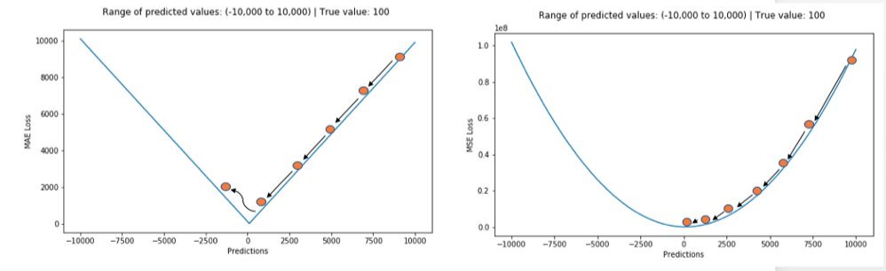
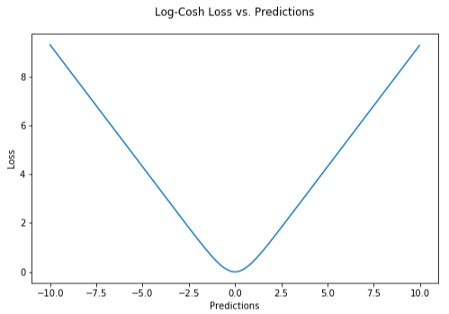
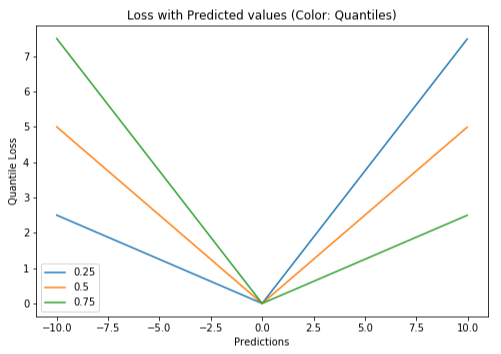
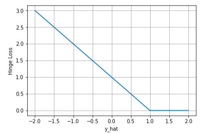
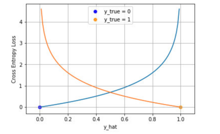
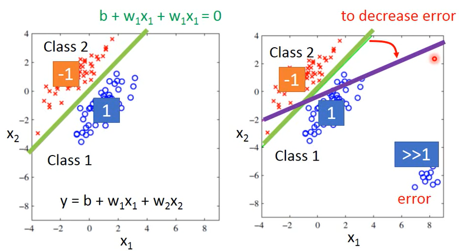
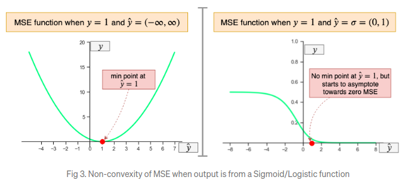
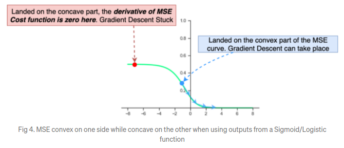

# 一、什么是损失函数

> 损失函数 （Loss Function） 也可称为代价函数 （Cost Function）或误差函数（Error Function），**用于衡量预测值与实际值的偏离程度**

机器学习的目标就是希望预测值与实际值偏离较小，也就是希望损失函数较小，也就是所谓的**最小化损失函数**。

# 二、回归损失

## 1）Mean Absolute Error (MAE)

> MAE 也称之为 **L1 Loss**

### 1. 数学表达式

$$
\mathrm{MAE}=\frac{\sum_{i=1}^{n}\left|y_{i}-\hat{y}_{i}\right|}{n}
$$

- MAE Loss 是预测值与真实值之间差值的绝对值之和，取平均值
- MAE Loss 对数据集中的离群点并不敏感，即相对于 MSE  来说，MAE 对离群点更加具有**鲁棒性**
- 所以当数据集中存在较多的离群点的时候，MAE 是更加好的选择

### 2. 稳定性

- 当在数据集上添加一个扰动 $\triangle$ 的时候，相应的在loss 上也有 $\triangle$ 大小的 Loss
- 从这个角度来说，MAE 相对于 MSE  来说，更不稳定一些

## 2）Mean Squared Error(MSE)

### 1. MSE 的数学表达式

> MSE 也称之为 **L2 Loss**

$$
\operatorname{Loss}=\frac{\sum_{i=0}^{n}\left(Y_{i}-\hat{Y}_{i}\right)^{2}}{n}
$$

- 直接取真实值（ground-truth）与预测值对应元素平方差之和的平均值
- 是使用比较广泛的 Loss，形式简单，但是比较有效
- 当不存在离群点的时候，因为平方的存在，会增大惩罚力度
- 当存在离群点的时候，MSE Loss 并不能正确地反映当前模型的表现，当移除离群点之后，MSE loss 差别会很大；从这个角度讲，MSE 对离群点是不鲁棒的；所以，如果数据中存在较多的离群点，就不应该适应 MSE 作为 Loss Function

### 2. 稳定性

1. 稳定性的评估可以通过给数据添加一些扰动，来观察 Loss 的变化来实现
2. 当给数据添加一个扰动 $\Delta<< 1$，那么对于 Loss 的扰动将会是 $\Delta^{2}<<<1$
3. 因此，MSE 是一种稳定的 Loss Function

## 3）比较 MAE & MSE

1. 对于**离群点，MAE 鲁棒性更好**，所以当数据中存在较多的离群点的时候，采用 MAE 是更好的选择

2. 稳定性：**MSE 的稳定性更好**一点，具体可以看上面的说明

3. 优化问题：使用MAE损失（特别是对于神经网络来说）的一个大问题就是，其**梯度始终一样**

   1. 这意味着梯度即便是对于很小的损失值来说，也还会非常大
   2. 为了修正这一点，我们可以使用动态学习率，它会随着我们越来越接近最小值而逐渐变小。
   3. 在这种情况下，MSE会表现的很好，即便学习率固定，也会收敛。MSE损失的梯度对于更大的损失值来说非常高，当损失值趋向于0时会逐渐降低，从而让它在模型训练收尾时更加准确

   

## 4）Huber Loss【平滑平均绝对误差】

Huber Loss 实际上是结合了 MSE 和 MAE 两种方法的优点：
$$
L_{\delta}(y, f(x))=\left\{\begin{array}{ll}\frac{1}{2}(y-f(x))^{2} & \text { for }|y-f(x)| \leq \delta \\\delta|y-f(x)|-\frac{1}{2} \delta^{2} & \text { otherwise }\end{array}\right.
$$

- 当  ${ \delta } \rightarrow 0$ 时，Huber损失会趋向于MAE；当 $\delta \rightarrow \infty$（很大的数字），Huber损失会趋向于MSE
- 实际上就是确定一个阈值 $\delta$
  1. 当预测值与真实值之间的距离小于 $\delta$ 的时候，使用的是 MSE
  2. 当预测值与真实值之间的距离大于 $\delta$ 的时候，使用的是 MAE
- Huber Loss 对离群点更加鲁棒
- 但是需要确定一个超参数 $\delta$

## 5）Log-Cosh损失函数

> Log-Cosh 是应用于回归任务中的另一种损失函数，它比L2损失更平滑。
>
> Log-cosh是预测误差的双曲余弦的对数。

$$
L\left(y, y^{p}\right)=\sum_{i=1}^{n} \log \left(\cosh \left(y_{i}^{p}-y_{i}\right)\right)
$$

- 对于较小的 X 值，log(cosh(x)) 约等于 (x ** 2) / 2；
- 对于较大的 X 值，则约等于 abs(x) - log(2)。

- 这意味着Log-cosh很大程度上工作原理和平均方误差很像，但偶尔出现错的离谱的预测时对它影响又不是很大。
- 它具备了Huber损失函数的所有优点，但不像Huber损失，它在所有地方都二次可微。
- 但Log-cosh也不是完美无缺。如果始终出现非常大的偏离目标的预测值时，它就会遭受梯度问题，因此会导致 XGboost 的节点不能充分分裂。

## 6）Quantile损失函数

Quantile 损失实际上就是 MAE 的延伸（当分位数为第50个百分位数时，它就是MAE）。
$$
L_{\gamma}\left(y, y^{p}\right)=\sum_{i=y_{i}<y_{i}^{p}}(\gamma-1) .\left|y_{i}-y_{i}^{p}\right|+\sum_{i=y_{i} \geq y_{i}^{p}}(\gamma) .\left|y_{i}-y_{i}^{p}\right|
$$

- γ 就是所需的分位数，值范围在0和1之间。

# 三、二分类损失函数

## 1）合页损失 Hinge Loss

> 用于 maximum-margin 的分类，支持向量机 Support Vector Machine (SVM) 模型的损失函数本质上就是 Hinge Loss + L2 正则化

$$
J_{\text {hinge }}=\sum_{i=1}^{N} \max \left(0,1-\operatorname{sgn}\left(y_{i}\right) \hat{y}_{i}\right)
$$

上图是 y 为正类， 即 sgn(y)=1 时，不同输出的合页损失示意图

- 可以看到当 y 为正类时，模型输出负值会有较大的惩罚，当模型输出为正值且在 (0, 1) 区间时还会有一个较小的惩罚。
- 即合页损失不仅惩罚预测错的，并且对于预测对了但是置信度不高的也会给一个惩罚，只有置信度高的才会有零损失。
- 使用合页损失直觉上理解是要找到一个决策边界，使得所有数据点被这个边界**正确地、高置信**地被分类。

## 2）Binary Cross-Entropy 交叉熵损失

在理解交叉熵损失之前，需要首先了解什么是熵【[熵、互信息、相对熵](https://zhuanlan.zhihu.com/p/36192699)】
$$
\text { Loss }=\sum_{i=0}^{n}\left[-Y_{i} \log \left(\hat{Y}*{i}\right)-\left(1-\hat{Y}*{i}\right) \log \left(1-\hat{Y}_{i}\right)\right]
$$

- 右图是对二分类的交叉熵损失函数的可视化
- 蓝线是目标值为 0 时输出不同输出的损失，黄线是目标值为 1 时的损失。
- 可以看到约接近目标值损失越小，随着误差变差，损失呈指数增长。

# 四、多分类损失函数

## 1）多分类交叉熵损失

> 实际上就是：**softmax + 交叉熵损失**；也是对二分类交叉熵损失的一种扩展

$$
L=\frac{1}{N} \sum_{i} L_{i}=-\frac{1}{N} \sum_{i} \sum_{c=1}^{M} y_{i c} \log \left(p_{i c}\right)
$$

- M：类别的数量
- $y_{ic}$：符号函数（ 0 或 1 ），如果样本 $i$ 的真实类别等于 $c$ 取 1 ，否则取 0
- $p_{ic}$：观测样本 $i$ 属于类别 $c$ 的观测概率

# 五、为什么分类问题不能使用 MSE

## 1）不能直接将回归应用于分类问题

- 如下图所示，线性回归使用的是 最小二乘法计算 Loss，寻找使得 Loss 最小的一组参数；

- 对于分类问题，但出现右图中情况的时候，根据最小二乘法，会找到紫色的直线，明显是不合理的

  

## 2）原因分析

### 1. 从损失函数的物理意义来说

- MSE衡量的是**预测值和目标值的欧式距离**
- 交叉熵是一个信息论的概念，交叉熵能够衡量同一个随机变量中的**两个不同概率分布的差异程度**，在机器学习中就表示为真实概率分布与预测概率分布之间的差异。交叉熵的值越小，模型预测效果就越好
- **分类问题中 label 的值大小在欧氏空间中是没有意义的**。所以分类问题不能用 MSE 作为损失函数

### 2. 从优化求解角度来说

1. 分类问题通常使用 sigmoid 作为激活函数，这样 MSE 存在的连乘项有可能会导致**梯度消失**

2. MSE 函数对于二分类问题来说是非凸的

   1. 简单来说就是**不能保证能够最小化 Loss Function**

   2. 因为对于 MSE 期望实数的输入范围是 $(-\infty, \infty)$，但是对于分类问题来说，通过 sigmoid 函数之后，输出范围是 (0, 1)

      

   3. 下图，函数的一侧是凹的，而另一侧是凸的，没有明确的最小值点。因此，如果在初始化二分类神经网络权重时，权值万一设置得很大，使其落在 MSE 凹的那一侧（如下图红色标记的点），由于梯度几乎为 0，损失函数梯度下降法将不起作用，因此网络权重可能得不到更新或改善得非常缓慢。这也是训练时应采用小值来初始化神经网络的原因之一。

      

### 3. 从数据分布角度

1. 如果使用 MSE 作为损失函数，意味着假设数据采样误差是遵循**正态分布**的，即做了高斯先验的假设
2. 如果假设误差遵循正态分布，并使用最大似然估计，我们将会得出 MSE 就是优化模型的损失函数
3. 但是实际上**二分类的数据集遵循伯努利分布**【其实下面的 Logistics Regression 也是很好的证明】

## 3）Logistic Regression

1. 我们想要 $h_\theta(x) \in [0, 1]$，因此我们可以定义：$h_\theta(x) = g(\theta^Tx) = \frac{1}{1+e^{-\theta^Tx}}$【我们的**模型假设函数**】

   其中：$g(z) = \frac{1}{1+e^{-z}}$，称之为 sigmod 或者 logistic

2. 由此，我们可以得到：

   - $p(y=1|x;\theta) = h_\theta(x)$
   - $p(y = 0|x;\theta)=1-h_\theta(x)$
   - 上面的两个式子可以进一步合并为一个式子：$p(y|x;\theta)=h_\theta(x)^y(1-h_\theta(x))^{1-y}$

3. 从我们得到的概率公式，可以利用已有的 examples 进行最大似然估计：
   $$
   L(\theta) = \prod_{i=1}^{m}p(y^{(i)}|x^{(i)};\theta) = \prod_{i=1}^{m}h_\theta(x^{(i)})^{y^{(i)}}(1-h_\theta(x^{(i)})){1-y^{(i)}}
   $$

   $$
   l(\theta) = \sum_{i=1}^{m}y^{(i)}logh_\theta(x^{(i)}) + (1-y^{(i)})log(1-h_\theta(x^{(i)})) 【本质上是交叉熵】
   $$

   - 对等式两边取对数，简化运算，然后求导，找出导数为 0 的点，这个点就是使得似然概率最大的点；

   - 或者使用梯度下降/上升原理：$\theta_j:=\theta_j + \alpha\frac{\partial}{\partial\theta_j}l(\theta)$，因为这里是计算最大的概率，因此使用的是加上梯度方向；
     $$
     \theta_j := \theta_j + \alpha\sum_{i=1}^{m}(y^{(i)} - h_\theta(x^{(i)}))x_j^{(i)}
     $$

# Reference

1. [常用损失函数](https://mp.weixin.qq.com/s/dsMyxiweMGhjD-YVM854IA)
2. [A Detailed Guide to 7 Loss Functions for Machine Learning Algorithms with Python Code](https://www.analyticsvidhya.com/blog/2019/08/detailed-guide-7-loss-functions-machine-learning-python-code/)
3. [Common loss functions that you should know!](https://medium.com/ml-cheat-sheet/winning-at-loss-functions-common-loss-functions-that-you-should-know-a72c1802ecb4#id_token=eyJhbGciOiJSUzI1NiIsImtpZCI6IjNkZjBhODMxZTA5M2ZhZTFlMjRkNzdkNDc4MzQ0MDVmOTVkMTdiNTQiLCJ0eXAiOiJKV1QifQ.eyJpc3MiOiJodHRwczovL2FjY291bnRzLmdvb2dsZS5jb20iLCJuYmYiOjE2Mjc3MTkxNTcsImF1ZCI6IjIxNjI5NjAzNTgzNC1rMWs2cWUwNjBzMnRwMmEyamFtNGxqZGNtczAwc3R0Zy5hcHBzLmdvb2dsZXVzZXJjb250ZW50LmNvbSIsInN1YiI6IjEwNDA0MDYxOTI0NzkxNDM1OTk5OSIsImVtYWlsIjoiZ3VvYmFveWFuOTNAZ21haWwuY29tIiwiZW1haWxfdmVyaWZpZWQiOnRydWUsImF6cCI6IjIxNjI5NjAzNTgzNC1rMWs2cWUwNjBzMnRwMmEyamFtNGxqZGNtczAwc3R0Zy5hcHBzLmdvb2dsZXVzZXJjb250ZW50LmNvbSIsIm5hbWUiOiJCYW95YW4gR3VvIiwicGljdHVyZSI6Imh0dHBzOi8vbGgzLmdvb2dsZXVzZXJjb250ZW50LmNvbS9hL0FBVFhBSnpmdFpDOXZJcmd3UktxZ1NxdVR2R0lBa0dSR21oanJPQUlJVTA0PXM5Ni1jIiwiZ2l2ZW5fbmFtZSI6IkJhb3lhbiIsImZhbWlseV9uYW1lIjoiR3VvIiwiaWF0IjoxNjI3NzE5NDU3LCJleHAiOjE2Mjc3MjMwNTcsImp0aSI6ImNhYjYyNjM2YWEzYjYzMDkwYTNhYzU3NjA4ZDM0YmEwMTQwNzczOTcifQ.LCma0DfbjTkbXyIp8WznBHcHPwvf7yYoiJBmr8roCqZKQXEofqGaTqTBVm-3FfA5ALCEzicSU8_G4H9Ng-tXgeRbvijTryEinr12US5NUzvGpzxlOqgP8zFXNA2aGj210HrCmRoB4TklxRp9Za9ccpN4mAbCFtKUIv8KPQaE4iVkKmNL4CJnrjyOByZBJH6MWjjAmYrTsMLXlSV9sFV_Kg8TrWFDM1DLCK236PWF_EOGhgkTO59wWKmgGFV0rACunXe0H7skWKoHfkWaIfhj2kN9yTLzySo4jipvbVZmn2GwJdDNxgrlPz9FyP8jl3CS11PBmVFQWpSlZmqC2JACXg)
4. [机器学习从业者必知的5种回归损失函数](https://zhuanlan.zhihu.com/p/39239829)
5. [5 Regression Loss Functions All Machine Learners Should Know](https://heartbeat.fritz.ai/5-regression-loss-functions-all-machine-learners-should-know-4fb140e9d4b0)
6. [机器学习常用损失函数小结](https://zhuanlan.zhihu.com/p/77686118)
7. [损失函数｜交叉熵损失函数](https://zhuanlan.zhihu.com/p/35709485)
8. [AI 面试高频问题: 为什么二分类不用 MSE 损失函数？](https://jishuin.proginn.com/p/763bfbd2bbb3)
9. [Why Using Mean Squared Error(MSE) Cost Function for Binary Classification is a Bad Idea?](https://towardsdatascience.com/why-using-mean-squared-error-mse-cost-function-for-binary-classification-is-a-bad-idea-933089e90df7)
10. [Where did the Binary Cross-Entropy Loss Function come from?](https://towardsdatascience.com/where-did-the-binary-cross-entropy-loss-function-come-from-ac3de349a715)