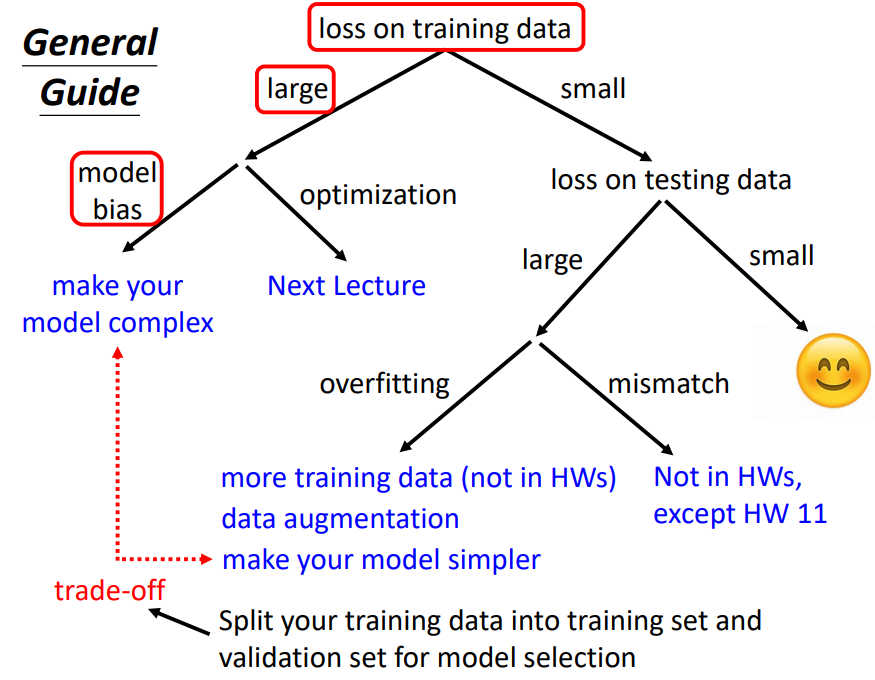
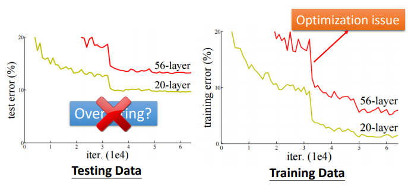
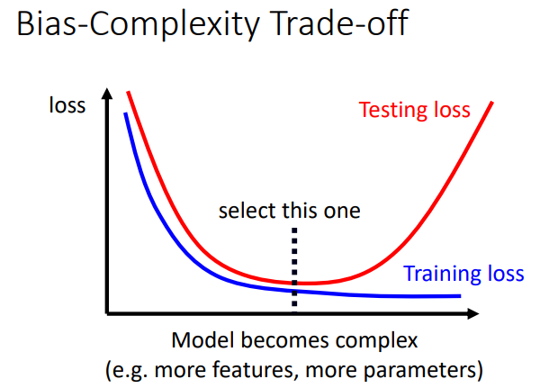
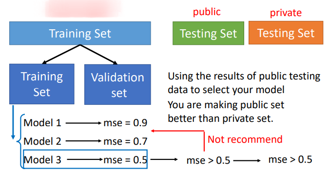
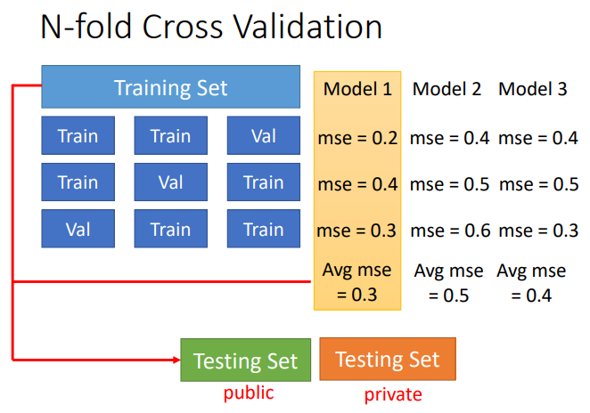

# 一、机器学习任务攻略概览

> 在训练的过程中，我们可能会遇到各种各样的问题，在遇到问题的时候怎样处理是我们要考虑的，这样我们才能更好、更快地解决问题
>
> 在训练机器学习任务的时候，可以按照下面的方法判断问题所在

## 1）training data loss 大

通常出现 training data 的 loss 比较大会有两个原因：

1. **模型过于简单**
2. **Optimization 不够好**，即优化方法不好，不能有效地优化参数

### 1.1 模型过于简单

> 这种情况相当于，在这种模型的情况下，任何参数组合都不可能比较好的解决问题；

1. 挑选更多的 Features
2. 使用更深的模型（更多的节点，更多的层）

### 1.2 Optimization 不够好

> 这种情况就是，存在一个比较好的参数组合解决这个问题，但是使用的 Optimization 方法不能帮我们找到这个最优解 
>
> 比如我们使用的是梯度下降算法，但是卡在的局部最优解

- 更加好的 Optimization 的方法
  - 使用更好的梯度下降算法，比如 Adam （使用了动量，并且学习率可以自适应）

### 1.3 怎样确定是哪一种问题

实际上解决这个问题，我们可以通过比较的方式

1. 一个例子：

   - 下图中，首先看 56 层的神经网络和 20 层的神经网络在 testing data 上的表现，发现 56 层的表现还不如 20 层，但是这个问题并不是 overfitting
   - 继续看两个模型在 training data 上的表现，发现 56 层的神经网络的表现还是表现比较差；
   - 那么可以断定，这时候出现的在 training data 上表现比较差的原因并不是模型过于简单，而是因为 Optimization 的问题

   

2. 实际操作

   1. 当面对一个问题的时候，**从一个比较浅的模型开始训练**，或者使用非深度学习的方法开始【通常非深度学习的方法比较容易优化】
   2. 接着给模型增加一些深度，如果**更深的模型在 training data 上的 loss 比浅的模型更大**，那说明这是 Optimization 问题

## 2）在 training Data 上 Loss 比较小

> **当在 training data 上 loss 比较小，我们这时候就要看 test data 上的 loss**：
>
> 1. 如果 testing data  上的 loss 非常小，那么这个训练觉结束了，因为已经达到了我们的预期；
> 2. 如果在 testing data 上的 loss 比较大，或者说比在 training data 上大很多，这时候就需要排查问题

在 training data 上的 loss 比较小的前提下，如果 testing data 上的 loss 比较大，这时候有两种可能的原因：

1. 过拟合（overfitting）
2. mismatch

### 2.1 过拟合（overfitting）

过拟合的解决方案：

1. **增加训练样本的数量**：
   - 收集更多的训练样本
   - 数据增强（data augmentation），比如图片的翻转、裁剪
2. **减小模型的复杂度**；通常需要对问题的理解
   - 减少参数的数量 ；比如使用卷积核，共用参数
   - 使用较少的 features
   - Eearly stop
   - 正则化 Regularization
   - Dropout

### 2.2 MisMatch

> **所谓的 mismatch 就是训练集和测试集的数据有不一样的分布**

# 二、Bias-Complexity Trade-off

> 实际上，我们需要针对我们的任务找到合适的模型的复杂度

如下图所示，随着模型的复杂度的提升（使用更多的参数、更深的模型、更多的 feature）：

- 在 training data 上的表现会**越来越好**
- 在 testing data 上的表现会**先变好后变坏**

## 1）怎样选择模型

> 既然我们需要挑选合适复杂度的模型，但是我们只能不断的尝试去选择一个好的模型，那么该怎样在多个 model 中进行选择呢？

### 通常的做法

通常，我们会将我们的数据分为三个部分：训练集、验证机、测试集；

- 使用训练集训练模型
- 使用验证集挑选模型
- 使用测试集进行测试【**永远不要根据测试集来优化、挑选我们的模型**】
- private 测试集相当于我们的模型用在实际的场景中的测试

### 划分数据集

既然数据集要划分成三个部分，那么怎样去划分数据集呢？当我们的数据集比较小的时候，非常时候使用 N-fold Cross Validation

- 将数据平均分成 N 份
- 轮流将其中一份当做 val data

