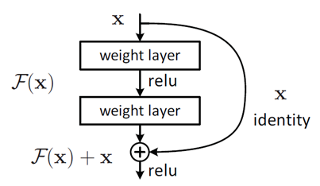

# 一、背景与原因

## 1）什么是梯度消失和梯度爆炸

> 神经网络最终的目的是希望**损失函数 loss 取得极小值**。所以最终的问题就变成了一个寻找函数最小值的问题；通常使用**梯度下降**（求导）来解决
>
> **梯度消失相比梯度爆炸更为常见**

- 梯度消失、梯度爆炸其**根本原因**在于反向传播训练法则（BP算法）
  - 是指在使用梯度下降法对误差进行反向传播时，由于求偏导累乘而出现趋于0（梯度消失）或者趋于无穷大（梯度爆炸）的问题
- 梯度消失和爆炸出现的原因经常是因为**网络层次过深**，以及**激活函数选择不当**，比如sigmoid函数
  - 从深层网络角度来讲，不同的层学习的速度差异很大；
  - 表现为网络中靠近输出的层学习的情况很好，靠近输入的层学习的很慢，有时甚至训练了很久，前几层的权值和刚开始随机初始化的值差不多。
  - 因此，梯度消失、爆炸，其根本原因在于**反向传播训练法则，属于先天不足**

## 2）梯度消失和梯度爆炸的影响

1. 梯度消失：
   - 当梯度消失发生时，接近于输出层的隐藏层由于其梯度相对正常，所以权值更新时也就相对正常；
   - 但是当越靠近输入层时，由于梯度消失现象，会导致**靠近输入层的隐藏层权值更新缓慢或者更新停滞**；
2. 梯度爆炸：
   - 当梯度爆炸发生时，初始的权值过大，靠近输入层的权值变化比靠近输出层的权值变化更快，就会引起梯度爆炸的问题；
   - 会导致**模型不稳定**，更新过程中的损失出现显著变化；
   - 也可能导致训练过程中，模型损失变成 NaN；

# 二、解决方案

## 1）使用合适的激活函数

- 选择**合适的激活函数对于缓解梯度消失和梯度爆炸都非常重要**
- Sigmoid 作为激活函数更加容易出现梯度消失的问题，为了缓解这样的问题可以使用 ReLU 及其变形作为激活函数，可以比较好地缓解梯度消失的问题
- 具体关于激活函数的介绍，请参见【激活函数】相关内容

## 2）Batch Normalization

> BN 本质上是解决反向传播过程中的梯度问题；通过规范化操作将输入信号规范化保证网络的稳定性

- Sigmoid 作为激活函数会出现饱和性的梯度消失问题
- Batch Normalization 通过**对每一层节点的输入的均值和方差进行规范化**，来解决梯度消失和爆炸的问题，或者可以理解为BN将输入从饱和区拉倒了非饱和区。
- 但是多个0~1之间的数相乘还是趋近于0的趋势没变，所以只是缓解，而非完全解决
- 具体 Batch Normalization 的详细介绍，参见【Normalization】相关内容

## 3）梯度裁剪

梯度剪切这个方案**主要是针对梯度爆炸**提出的

- 主要思想：
  - 设置一个梯度裁剪阈值；
  - 更新梯度的时候，如果梯度超过这个阈值，那么就将其强制限制在这个范围之内

- 另一种防止梯度爆炸的手段是采用**权重正则化，**比如 L1，L2 正则化
  - 正则化主要是通过对网络权重做正则来限制过拟合
  - 可以看出，如果发生梯度爆炸，那么权值的范数就会变的非常大，反过来，通过限制正则化项的大小，也可以在一定程度上限制梯度爆炸的发生

## 4）网络结构

1. ResNet 残差网络结构

   1. 用来解决**网络退化**的问题：网络深度增加时，网络准确度出现饱和，甚至出现下降

   2. 残差网络单元：

      

   3. 因为残差的存在，梯度可以传播的“更远”，靠近输入的部分网络结构也可以通过梯度下降更新网络

      直观的理解是，导数整体加了1，相比原先就不那么容易梯度消失了
      $$
      \frac{\partial X_{L}}{\partial X_{l}}=\frac{\partial X_{l}+F\left(X_{l}, W_{l}, b_{l}\right)}{\partial X_{l}}=1+\frac{\partial F\left(X_{L}, W_{L}, b_{L}\right)}{\partial X_{L}}
      $$

2. LSTM 结构：

   - LSTM 是不那么容易发生梯度消失的，主要原因在于LSTM内部复杂的“门”(gates)
   - cell状态的**加法更新策略**使得梯度传递更恰当
     - 在 RNN 中，每个记忆单元 $h_{t-1}$ 都会乘上一个 W 和激活函数的导数，这种连乘使得记忆衰减的很快；
     - 而LSTM是通过记忆和当前输入"**相加**"，使得**之前的记忆会继续存在**而不是受到乘法的影响而部分“消失”，因此不会衰减
   - 门控单元可以**决定遗忘多少梯度**，他们可以在不同的时刻取不同的值。这些值都是通过隐层状态和输入的函数学习到的

# Reference

1. [梯度消失和梯度爆炸问题详解](https://www.jianshu.com/p/3f35e555d5ba)
2. [梯度消失问题与如何选择激活函数](https://www.jianshu.com/p/c663542f56fe)
3. [你必须要知道CNN模型：ResNet](https://zhuanlan.zhihu.com/p/31852747)
4. [Why LSTMs Stop Your Gradients From Vanishing: A View from the Backwards Pass](https://weberna.github.io/blog/2017/11/15/LSTM-Vanishing-Gradients.html)
5. [为什么LSTM会减缓梯度消失？](https://zhuanlan.zhihu.com/p/109519044)