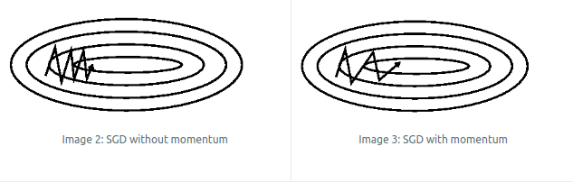
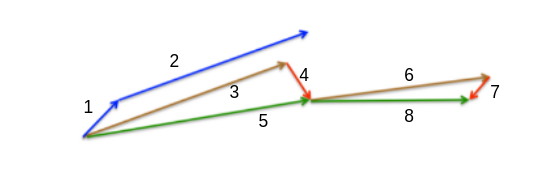
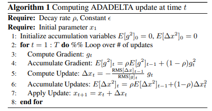
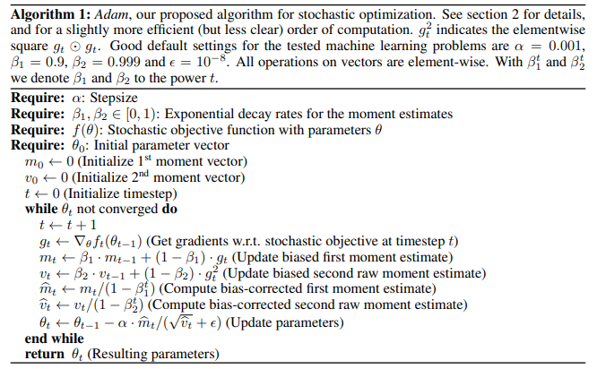
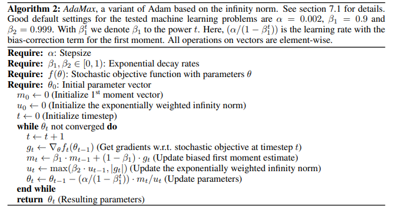
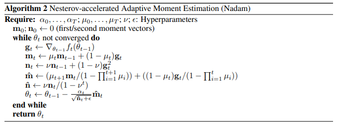
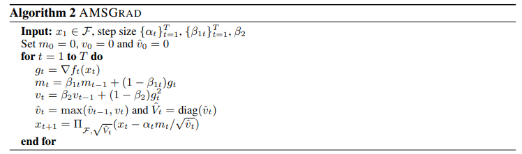

> 深度学习就是要训练一个模型来拟合实际问题从而解决实际问题，实质就是要**找到一组参数能够最好地拟合实际问题**
>
> 但是怎样找到这样的一组参数呢？现在最流行的优化算法就是**梯度下降算法**
>
> 本文主要参考的是参考文献中的第一篇博客（Sebastian Ruder），但是针对一些自己认为不清楚的地方专门查找相关论文进行补充

# 一、梯度下降算法简介

1. 梯度下降算法按照发展的脉络，依次为 SGD → SGDM → NAG → AdaGrad → AdaDelta → Adam → Nadam → AMSGrad；

2. 梯度下降算法流程

   ，假设：当前的参数 $w_t$，学习率 $\alpha$ ，损失函数 $f(w_t)$ ：

   1. 计算损失函数关于当前参数的梯度： $g_{t}=\nabla f\left(w_{t}\right)$
   2. 根据学习率以及其他的因素，确定当前更新的梯度 $\eta_t$ 【不同的梯度下降算法，计算方法不同】
   3. 更新参数：$w_{t+1} = w_t - \eta_t$，接下来回到第一步，直到满足结束条件

3. 各种梯度下降算法中，第一和第三步是相同的，只有第二步不同

# 二、常用梯度下降算法

## 一）SGD & BGD & MBGD

> 这三种最基本的梯度下降算法，三种算法本质上是相同的，唯一的区别在于每一次更新迭代使用的数据量的多少，**其中 MBGD 是三种方法中应用最多的**
>
> SGD：Stochastic Gradient Descent
>
> BGD：Batch Gradient Descent
>
> MBGD：Mini-Batch Gradient Descent

1. 相同的本质：第二步**计算更新梯度 $\eta_t$** 的方法相同：
   $$
   \eta_t = \alpha g_t
   $$

2. 不同点：

   1. SGD：每次更新参数随机选取一个样本作为计算梯度的依据
   2. BGD：每次更新参数使用整个数据集作为计算梯度的依据
   3. MBGD：每次更新参数随机选取一个小批次（mini batch）的数据作为计算梯度的依据

3. 因为 SGD 和 BGD 目前很少使用，就不再赘述，主要探讨 MBGD （一般在说 SGD 的时候通常指的就是 MBGD），这种方法**不能保证很好地收敛**，存在下面的问题：

   1. **选择合适的学习率 $\alpha$  比较困难**。如果学习率比较小，收敛速度就很慢；如果学习率比较大，就会使得损失函数在极小值处震荡，而不能收敛；
   2. 如果使用提前设计的策略来有计划地调整学习率的大小，这种方法往往不能很好地适应数据本身的特点
   3. **相同的学习率更新所有的参数**。当数据比较稀疏，不同特征出现的频率差别比较大的时候，我们可能希望对不同的参数的更新幅度有所不同，而 MBGD 是不能实现的
   4. **容易被困在局部最优点或者鞍点**。当然，局部最优点和鞍点哪一个带来的问题更大现在还有争论，但是 MBGD 可能会困于其中的任何一种；

4. MBGD 是最简单的一种梯度下降算法，为了解决其面临的问题，一些梯度下降算法的变种被提出

## 二）SGD + Momentum（SGDM）

- 如下图所示，当 feature map 在一个维度比另一个维度陡峭很多的时候，SGD 非常容易陷入震荡，从而导致难以收敛

- 第二步**计算更新梯度 $\eta_t$** 的方法：
  $$
  \eta_t = \gamma \eta_{t-1} + \alpha g_t
  $$
  其中 $\gamma$ 是一个超参数，通常设置为 0.9

- 优点：

  - 动量（Momentum）的存在，可以使得梯度方向不变的维度上速度变快，梯度方向有所改变的维度上的更新速度变慢，这样就可以**加快收敛并减小震荡**
  - 可以帮助跳过局部最优点和鞍点，从而得到更好的收敛结果

## 三）Nesterov accelerated gradient（NAG）

> NAG 是对 SGDM  的一种改进，使得梯度算法更加智能，能够对未来有一定的预判。

- 第二步**计算更新梯度 $\eta_t$** 的方法：
  $$
  \eta_t = \gamma \eta_{t-1} + \alpha   \nabla f\left(w_{t} - \gamma \eta_{t-1} \right)
  $$

  - 注意这里对 $g_{t}=\nabla f\left(w_{t}\right)$ 进行了修改

- 实现方法，如下图所示：

  - 我们知道在 SGDM 中 $\eta_t = \gamma \eta_{t-1} + \alpha g_t$，其中 $\alpha g_t$ 对应向量 1， $\gamma \eta_{t-1}$  对应于向量 2
  - 向量 2 对下一步的位置影响是比较大的，既然这样，我们就先在当前时刻 t 的时候，先使用向量 2 **虚拟地**更新参数，即使用向量 3 更新参数，计算此时的梯度 $\alpha   \nabla f\left(w_{t} - \gamma \eta_{t-1} \right)$，即向量 4
  - 使用向量 3 和向量 4 的和，即向量 5，实际地更新当前的参数即可：$\eta_t = \gamma \eta_{t-1} + \alpha   \nabla f\left(w_{t} - \gamma \eta_{t-1} \right)$

  

- 优点：

  - 这种更新的方式可以防止更新速度过快，尤其在 RNN 上效果比较好

- NAG 的**[另一种解释](https://cs231n.github.io/neural-networks-3/)**

- 注意：到目前为止，所介绍的优化算法能够根据 error surface 的斜率调整更新的速度；下面介绍的优化算法，我们希望**不同的参数根据其重要性，能够有不同的更新速率**

## 四）AdaGrad（Adaptive gradient algorithm）

> AdaGrad 算法可以**给与高频率 features 相联系的参数较小的学习率，给与低频率 features 相联系的参数较大的学习率**；
>
> 基于上面的特点，这种方法可以比较好地处理稀疏数据的任务。并且，这种方法提高了 SGD 的鲁棒性

- 第二步计算更新梯度 $\eta_t$ 的方法：

  - 一个模型存在大量的参数，不同的参数应该有不同的学习率，对于第 $i$ 个参数，有：
    $$
    \eta_{t,i} = \frac{\alpha}{\sqrt{G_{t,ii}+\epsilon}} g_{t,i}
    $$

  - $G_{t,ii}$ 表示第 $i$ 个参数从初始时刻到 t 时刻梯度平方之和；$\epsilon$  是平滑项，为了防止分母为 0 ，通常设置为 $1e-8$

- 优点：

  - 省去了手动调整学习率
  - $\alpha$   通常设置为 0.01

- 缺点：

  - $G_{t,ii}$ 是从初始时刻到当前时刻梯度平方之和，因此，这个值会不断积累变大
  - 最终会造成学习率不断下降，导致模型不能进一步优化【后面的算法将会着手解决这个问题】

## 五）RMSprop & Adadelta

> RMSprop 和 Adadelta 类似，都是对 AdaGrad 算法的改进，力求缓解 AdaGrad 中激进、单调地降低学习率的做法；

- 第二步**计算更新梯度 $\eta_t$** 的方法：

  - RMSprop 只是将 AdaGrad 中的 $G_{t,ii}$ 替换为过去所有梯度平方之和的衰减值

  $$
  E\left[g^{2}\right]_{t}=\gamma E\left[g^{2}\right]_{t-1}+(1-\gamma) g_{t}^{2}
  $$

  - 从而 RMSprop 中计算方法为：

  $$
  \eta_{t,i} = \frac{\alpha}{\sqrt{E[g^2]_t+\epsilon}} g_{t,i}
  $$

- Adadelta 则进一步的改进，去掉需要手动设置的学习率 $\alpha$ 【[论文地址](https://arxiv.org/abs/1212.5701)】

  

  - 首先，看刚才的公式
    $$
    \eta_{t} = \frac{\alpha}{\sqrt{E[g^2]_t+\epsilon}} g_{t}
    $$

  - 作者认为更新中的 units（单位） 是不匹配的（SGD, Momentum, or Adagrad 中都是不匹配的），就是说 update 应该与参数有相同的假设 units。【具体原因分析请查看论文原文】

  - 为了实现这个想法，作者定义了另一个类似的参数的衰减平方和：
    $$
    E\left[\Delta x^{2}\right]_{t}=\gamma E\left[\Delta x^{2}\right]_{t-1}+(1-\gamma) \Delta x_{t}^{2}
    $$

  - 为了简化公式，令：

    - $ RMS[\Delta x]_{t}=\sqrt{E\left[\Delta x^{2}\right]_{t}+\epsilon} $
    - $ RMS[g]_{t}=\sqrt{E\left[g^{2}\right]_{t}+\epsilon} $

  - 得到 Adadelta 中第二步**计算更新梯度 $\eta_t$** 的方法【这里**不需要手动设置学习率**】：
    $$
    \eta_t = \frac{RMS[\Delta x]_{t-1}}{RMS[g]_t}g_t
    $$

  - 注意上图中 $E[g^2]_t$ 和 $E[\Delta x^2]_t$ 的更新

## 六）Adaptive Moment Estimation（Adam）

> Adam 是另一种可以**为不同参数匹配不同学习率**的优化算法；Adam 可以认为**是 RMSprop 和 Momentum 的结合【**[论文地址](https://arxiv.org/abs/1412.6980)**】**

1. 第二步**计算更新梯度 $\eta_t$** 的方法：

   1. 计算一阶动量： $m_{t}=\beta_{1} m_{t-1}+\left(1-\beta_{1}\right) g_{t}$

   2. 计算二阶动量：$v_t=\beta_2 v_{t-1}+(1-\beta_2)g_t^2$

   3. 因为 $m_t$ 和 $v_t$ 初始都是零向量，作者观察到这两个值会偏向于零向量（偏差），尤其是在最初的迭代中更明显，因此要对这两个值进行修正（其中 $\beta_1^t$ 和 $\beta_2^t$ 表示 $\beta_1$ 和 $\beta_2$ 的 $t$ 次幂）

      - $\hat{m_t} = m_t /(1-\beta_1^t)$
      - $\hat{v_t} = v_t/(1-\beta_2^t)$

   4. 最终得到更新梯度 $\eta_t$ ：
      $$
      \eta_t = \frac{\alpha}{\sqrt{\hat{v_t} + \epsilon}} \hat{m_t}
      $$

2. Adam 算法伪代码

   

## 七）AdaMax

> AdaMax 是 Adam 的一种变形，是基于无限范数的

1. 基本思想：

   - 在计算二阶动量 $v_t$ 的时候，使用的是两个相反缩放因子，分别是当前梯度和过去梯度的 $L_2$ 范数，我们可以将 $L_2$ 范数扩展到  $L_p$ 范数（注意：$\beta_2$ 的幂也发生变化）；
     $$
     v_t = \beta_2 v_{t-1} + (1-\beta_2)|g_t|^2
     $$

     $$
     v_t = \beta_2^p v_{t-1} + (1-\beta_2^p)|g_t|^p
     $$

   - 但是高次范数通常是不稳定的，这也是 $L_1$ 和 $L_2$ 范数比较流行的原因；然而，一个特例是无限范数（$L_{\infty}$）也是稳定的，为了区别于 Adam，这里使用 $u$ 代替 $v$
     $$
     \begin{aligned}u_{t} &=\beta_{2}^{\infty} v_{t-1}+\left(1-\beta_{2}^{\infty}\right)\left|g_{t}\right|^{\infty} \\&=\max \left(\beta_{2} \cdot v_{t-1},\left|g_{t}\right|\right)\end{aligned}
     $$

2. 第二步**计算更新梯度 $\eta_t$** 的方法:

   1. 计算一阶动量： $m_{t}=\beta_{1} m_{t-1}+\left(1-\beta_{1}\right) g_{t}$

   2. 计算高阶动量：$u_t = max(\beta_2 u_{t-1}, \space |g_t|)$

   3. 计算 $\eta_t$：
      $$
      \eta_t = \frac{\alpha / (1-\beta_1^t)}{u_t}m_t
      $$

3. AdaMax 算法伪代码

   

## 八）Nesterov-accelerated Adaptive Moment Estimation（Nadam）

> 如前所述，**Adam 可以看作是 RMSprop 与 momentum 的结合**。RMSprop 提供了过去所有梯度的衰减平方和 $v_t$，而 momentum 提供了过去所有梯度的所有衰减和 $m_t$
>
> 但是，我们并没有考虑 Nesterov accelerated gradient (NAG) 算法的优势，这种算法的表现是超过 SGDM 的
>
> **Nadam 是 Adam 与 NAG 的结合**【[论文地址](https://openreview.net/forum?id=OM0jvwB8jIp57ZJjtNEZ)】，在 Adam 的基础上考虑未来的因素

为了与作者论文保持一致，此处使用与原作者相同的符号表示；论文中的 $\mu, v$ 是超参数，但是作者认为 $\mu$ 随时间逐渐地上升或者下降是有利于训练的，因此，每一个时间步 $t$ ，都有对应的 $\mu_t$，学习率 $\alpha$  也是同样的道理

1. 首先，回顾一下原始 SGDM 的更新方法：
   $$
   \begin{aligned} m_t &= \mu m_{t-1} + \alpha_tg_t \\ \theta_t &= \theta_{t-1} - m_t  \\  \theta_t &= \theta_{t-1}-(\mu m_{t-1} + \alpha_tg_t) \end{aligned}
   $$

2. 回顾一下原始 NAG 的更新方法：
   $$
   \begin{aligned}\mathbf{g}_{t} & \leftarrow \nabla_{\theta_{t-1}} f_{t}\left(\theta_{t-1}-\mu \mathbf{m}_{t-1}\right) \\\mathbf{m}_{t} & \leftarrow \mu \mathbf{m}_{t-1}+\alpha_{t} \mathbf{g}_{t} \\\theta_{t} & \leftarrow \theta_{t-1}-\mathbf{m}_{t}\end{aligned}
   $$

3. 回顾一下 Adam 的更新方法：
   $$
   \begin{aligned} m_{t}&=\mu m_{t-1}+\left(1-\mu \right) g_{t}   \\ n_t&=v n_{t-1}+(1-v)g_t^2  \\  \hat{m_t} &= m_t /(1-\mu^t) \\ \hat{n_t} &= n_t/(1-v^t)  \\  \eta_t &= \frac{\alpha}{\sqrt{\hat{n_t} + \epsilon}} \hat{m_t}    \end{aligned}
   $$

4. 为了将 NAG 引入到 Adam 中，作者对原始 NAG 的更新方法进行了修改：

   1. 下面的公式中，还是使用当前的当前的参数计算梯度，这个与一般的方法是相同的
   2. 第二步就是使用正常 SGDM 中的方法，计算一阶动量
   3. 第三步，正常应该是使用 $\mu_t m_{t-1} + \alpha_t g_t$ 来更新参数，**但是为了能够提前向前看一步（look ahead），作者使用 $\mu_{t+1}m_t$ 替换了 $\mu_tm_{t-1}$，也就是使用了本该下一步使用的动量**

   $$
   \begin{aligned}\mathrm{g}_{t} & \leftarrow \nabla_{\theta_{t-1}} f_{t}\left(\theta_{t-1}\right) \\\mathbf{m}_{t} & \leftarrow \mu_{t} \mathbf{m}_{t-1}+\alpha_{t} \mathbf{g}_{t} \\\theta_{t} & \leftarrow \theta_{t-1}-\left(\mu_{t+1} \mathbf{m}_{t}+\alpha_{t} \mathbf{g}_{t}\right)\end{aligned}
   $$

5. 使用类似的方法，在 Adam 中，我们也**使用当前得到的动量，而不是上一步的动量来更新参数**，就可以达到结合 NAG 的目的

   注意：**这个算法中，并没有修改Adam 中的 $\hat{n}$ （即 Adam 中的 $\hat{v_t}$），而只是修改了 $\hat{m_t}$**

   - 原始的 Adam 算法中 $\hat{m_t}$ 可以展开为：
     $$
     \hat{m_t} = \frac{\mu_{t} \mathbf{m}_{t-1}}{1-\prod_{i=1}^{t} \mu_{i}}+\frac{\left(1-\mu_{t}\right) \mathbf{g}_{t}}{1-\prod_{i=1}^{t} \mu_{i}}
     $$

   - 依据上面 4 中修改 NAG 的方法，使用当前的动量替换上一步的动量：
     $$
     \hat{m_t} = \frac{\mu_{t+1} \mathbf{m}_{t}}{1-\prod_{i=1}^{t+1} \mu_{i}}+\frac{\left(1-\mu_{t}\right) \mathbf{g}_{t}}{1-\prod_{i=1}^{t} \mu_{i}}
     $$

   - 最终更新梯度为：
     $$
     \eta_t = \frac{\alpha}{\sqrt{\hat{n_t} + \epsilon}} \hat{m_t}
     $$

6. 算法伪代码：

   

## 九）AMSGard

### 1）背景

- 近年来，自适应学习率的梯度下降算法几乎成为训练神经网络的标准方法
- 但是在实践中，存在一些场景，使用 Adam 的效果不如 SGDM，比如目标检测、机器翻译
- Reddi 提出 AMSGrad 方法【[论文地址](https://arxiv.org/abs/1904.09237)】，并指出问题之一在于：the exponential moving average of past squared gradients
- 在 Adam 收敛于局部最优解的场景中，一个现象被观察到：一些 mini batch 的数据提供了较大的、有用的梯度，但是因为这些 mini batch 的数据出现的频率非常低，因此 Adam 中过去平方和衰减的做法削弱了这些 mini batch 的作用，导致不能很好地收敛。

### 2）解决方案

1. 作者使用过去梯度平方的最大值来代替过去所有衰减梯度平方和，同时对 Adam 进行了简化

2. 第二步**计算更新梯度 $\eta_t$** 的方法：

   1. 与 Adam 中相同，计算一阶动量：$m_{t}=\beta_{1 t} m_{t-1}+\left(1-\beta_{1 t}\right) g_{t}$

   2. 与 Adam 中相同，计算二阶动量：$v_{t}=\beta_{2} v_{t-1}+\left(1-\beta_{2}\right) g_{t}^{2}$

   3. 不同点，求 $\hat{v_t}$：$\hat{v}_{t}=\max \left(\hat{v}_{t-1}, v_{t}\right)$

   4. 得到更新梯度 $\eta_t$：
      $$
      \frac{\alpha}{\sqrt{\hat{v}_{t}}+\epsilon} m_{t}
      $$

3. 算法伪代码：

   

### 3）注意

- 虽然 AMSGrad 在一些场景中表现比 Adam 要好，但是在另一些场景中表现不如 Adam

## 十）其他优化算法

1. AdamW：修复了 Adam 中的 weight decay
2. QHAdam
3. AggMo

上述算法详见这个[博客](https://johnchenresearch.github.io/demon/)

# 三、算法可视化

1. 损失曲面轮廓上的梯度下降算法：

   

2. 鞍点处不同优化算法的表现

   

# Reference

1. [An overview of gradient descent optimization algorithms](https://ruder.io/optimizing-gradient-descent/) 【主要参考，持续关注】
2. [一个框架看懂优化算法之异同 SGD/AdaGrad/Adam](https://zhuanlan.zhihu.com/p/32230623)
3. [深度学习最全优化方法总结比较（SGD，Adagrad，Adadelta，Adam，Adamax，Nadam）](https://zhuanlan.zhihu.com/p/22252270)
4. [从 SGD 到 Adam —— 深度学习优化算法概览(一)](https://zhuanlan.zhihu.com/p/32626442)
5. [深度学习——优化器算法Optimizer详解](https://www.cnblogs.com/guoyaohua/p/8542554.html)
6. [Adam那么棒，为什么还对SGD念念不忘 (2)—— Adam的两宗罪](https://zhuanlan.zhihu.com/p/32262540)
7. [Adam那么棒，为什么还对SGD念念不忘 (3)—— 优化算法的选择与使用策略](https://zhuanlan.zhihu.com/p/32338983)