> 之所以会要求进行模型的压缩，是因为有些场景下，可以使用的资源是有限的，比如智能手表，而且考虑到延迟和隐私的问题，这些是不能放在云端的

# 一、Network Pruning

> **思路**：网络中通常有非常多的**冗余的参数**，这些参数实际上是不起作用的，这里要做的就是要去掉这些冗余的参数

## 1）步骤

1. 训练一个比较大的模型
2. 评估参数或者结点的重要性
3. 去掉不重要的参数或者结点【每次修剪不要太大，否则会造成非常大的伤害】
4. 对已经优化的模型进行 fine-tune
5. 如果模型大小达到要求，则结束，否则回到第二步

 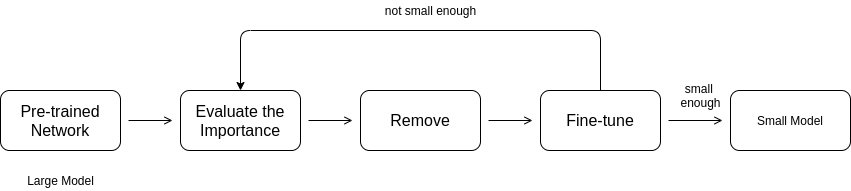

## 2）Weight pruning & Neuron pruning

### 2.1 Weight pruning

- 这种方法实际上是**以参数为单位进行剪枝**，但是这种方法存在的问题就是当剪枝以后，会造成模型不规则，在代码实现上非常困难
- 而为了让模型规则，会将已经剪枝的参数直接置为 0，但是这种方法实际上并没有进行剪枝
- 在速度上没有任何优势

### 2.2 Neuron pruning

- 这种方法是以神经元为单位进行剪枝，实现起来比较容易，而且也会极大地提高速度

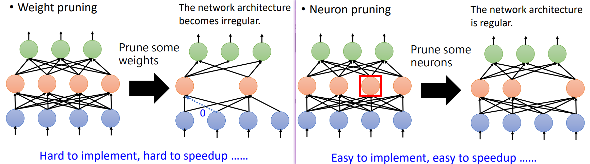

## 3）需要进行剪枝的原因

> 既然要先训练一个大模型，然后剪枝为一个小的模型，为什么不直接训练一个小的模型呢？但是在实际的操作中，直接训练一个小的模型往往是不能达到这种剪枝的效果的【大模型比较容易训练】

- [Deep Learning Theory 2-4: Geometry of Loss Surfaces (Conjecture)](https://www.youtube.com/watch?v=_VuWvQUMQVk)【李宏毅课程尝试回答为什么会这样】

- 一个假说：[Lottery Ticket Hypothesis](https://arxiv.org/abs/1803.03635)

  - 这种假说是说模型的训练是有一个定的随机性的，**训练一个大的模型，相当于同时训练多个小模型**，只要这些小模型中有一个可以解决这个任务，就可以了

  - 这样，大模型能够训练好的概率比小的模型训练好的概率大

  - 证明方法：先使用一个大的模型，随机初始化参数（红色），训练，剪枝，最终得到小的模型（紫色）；如果直接使用紫色的模型，随机初始化参数，这个模型是训练不起来的；但是如果使用紫色的模型，而还是使用红色的随机参数初始化模型，就可以训练起来

    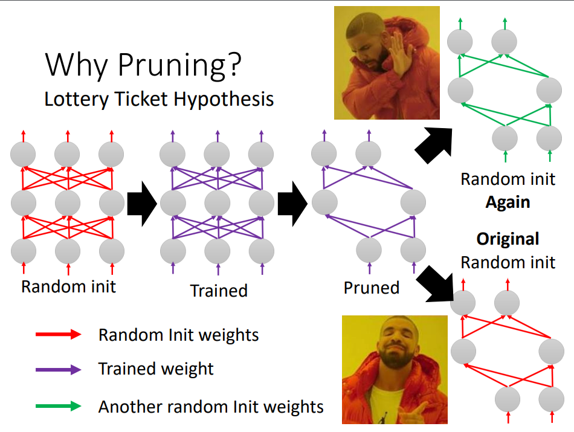

- 大乐透假说后续的发展【[论文](https://arxiv.org/abs/1905.01067)】

  - 研究发现，初始化参数对于训练的确非常重要，但是真正重要的是参数的正负号，而不是绝对值
  - 一个大的模型中，可能本身就已经存在一个比较好的参数组合，能够比较好地完成任务【[论文](https://arxiv.org/abs/1906.04358)】

- 另外一种解释：[Rethinking the Value of Network Pruning](https://arxiv.org/abs/1810.05270)【跟大乐透假说矛盾】

# 二、Knowledge Distillation【知识蒸馏】

## 1）算法简介

简单来说，知识蒸馏的方法（knowledge distillation）是为了压缩模型，主要使用在工业界，模型的部署阶段；在模型的训练阶段，实际上还是要训练一个复杂的模型（Teacher model），之后将这个 Teacher model 『教给』Student model，达到简化模型的目的：**即小的模型也能达到复杂模型的效果**；

- **Teacher Model**：模型相对复杂，也可以由多个分别训练的模型集成而成。我们对"Teacher模型"不作任何关于模型架构、参数量、是否集成方面的限制，唯一的要求就是，对于输入X, 其都能输出Y，其中Y经过softmax的映射，输出值对应相应类别的概率值
- **Student Model**：参数量较小、模型结构相对简单的单模型。同样的，对于输入X，其都能输出Y，Y经过softmax映射后同样能输出对应相应类别的概率值。

通常来说，这个方法主要是用在**分类**领域『作者提出在分类领域』，需要 softmax 函数的配合，其输出值对应了相应类别的概率值；

### 模型大小与模型能力

> 一个模型的参数量基本决定了模型的能力大小；

上面的思路基本上是正确的，但是需要注意：

1. 模型的参数量和模型的能力之间（或者说所能够捕获的『知识量』之间）并**不是线性关系，而是接近于边际收益逐渐减少；**
2. 完全相同的模型架构和模型参数量，使用完全相同的训练数据，能捕获的“知识”量并不一定完全相同，另一个关键因素是训练的方法。合适的训练方法可以使得在模型参数总量比较小时，尽可能地获取到更多的“知识”(右图中的3与2曲线的对比).

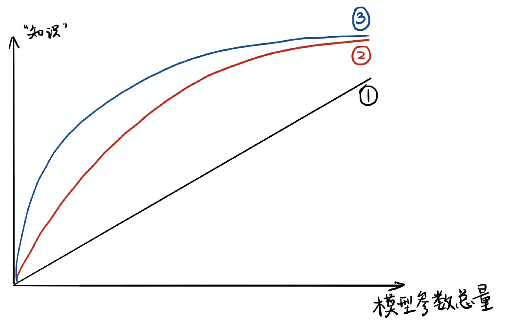

## 2）算法原理

> 机器学习最根本的目的在于训练出在某个问题上泛化能力强的模型；

传统的训练分类的时候，比如图片分类中，是使用一个标签（通常是 one-hot 编码）作为 ground-truth；

- 比如 Mnist 手写数字的识别，一个手写数字真实的标签是 2，即 [0, 0, 1, 0, 0, 0, 0, 0, 0, 0]；但是这个手写的数字在一定程度上可能是接近于 3 的，但是这个在 ground-truth 中并没有体现出来；

而在已经训练好的 Teacher Model 中，预测出来的标签可能是  [0, 0, 0.8, 0.2, 0, 0, 0, 0, 0, 0]；这种标签实际上是很有意义的，因为**负标签中也带有大量的信息**；

我们称传统的标签是 Hard Target，Teacher Model 的预测结果是 Soft Target，如右图所示，两个不同的 2，在 Hard Target 中是一样的标签，但是在 soft target 中是不一样的标签『有些负标签的概率远大于其他负标签』

这样，知识蒸馏（KD）的训练方式，**Student Model  可以从每个样本中获得更多的信息**

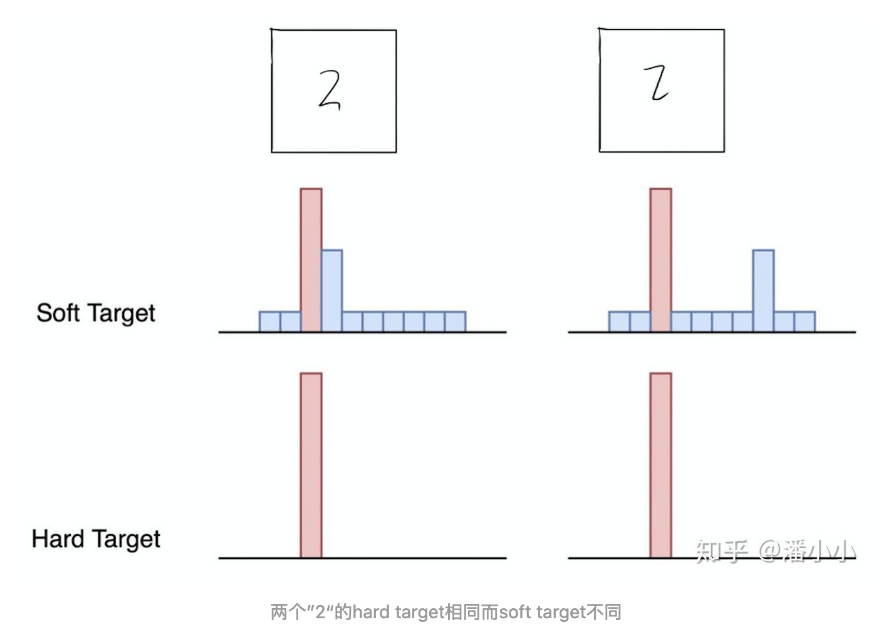

### Softmax 函数

softmax 函数的表达式：
$$
q_{i}=\frac{\exp \left(z_{i}\right)}{\sum_{j} \exp \left(z_{j}\right)}
$$
但是，直接使用 softmax 函数的输出作为 soft target 带来的问题是：当softmax输出的概率分布熵相对较小时，负标签的值都很接近0，对损失函数的贡献非常小，小到可以忽略不计；

因此，这里引入了『温度（T）』的概念：
$$
q_{i}=\frac{\exp \left(z_{i} / T\right)}{\sum_{j} \exp \left(z_{j} / T\right)}
$$
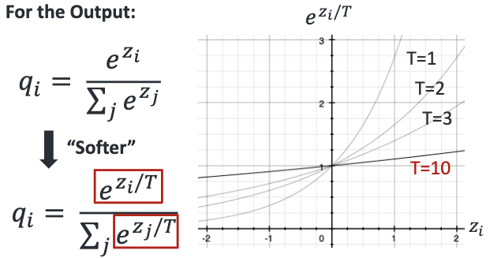

这个也称之为 Boltzmann distribution，softmax 函数是 T=1 的特殊情况；

- T 越高，softmax 的 output probability distribution 越趋于平滑，其分布的熵越大，负标签携带的信息会被相对地放大，模型训练将更加关注负标签；当 T 趋向于无穷的时候，就是均匀分布；
- T 接近于 0 的时候，此时softmax的值就相当于 argmax , 即最大的概率处的值趋近于1，而其他值趋近于0

## 3）实现方法

### 步骤

1. 使用正常的方法训练复杂的模型 Teacher Model【可以是多个模型，即集成学习】

2. 在高温 T 下，将 Teacher Model 蒸馏到 Student Model

   > 高温蒸馏过程的目标函数由distill loss(对应soft target)和student loss(对应hard target)加权得到

   - Net-T 和 Net-S同时输入 transfer set (这里可以直接复用训练 Net-T 用到的training set), 用Net-T产生的 softmax distribution (with high temperature) 来作为 soft target，Net-S 在**相同温度 T 条件下**的 softmax 输出和 soft target 的cross entropy 就是 Loss 函数的**第一部分 $L_{soft}$**
   - Net-S在 **T=1** 的条件下的softmax输出和ground truth的cross entropy就是Loss函数的**第二部分 $L_{hard}$**

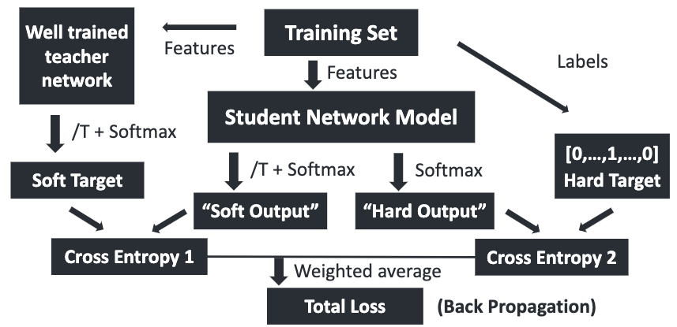

第二部分Loss $L_{hard}$ 的必要性其实很好理解: **Net-T也有一定的错误率，使用ground truth可以有效降低错误被传播给Net-S的可能**；

实验发现第二部分所占比重比较小的时候，能产生最好的结果，这是一个经验的结论。一个可能的原因是，由于soft target产生的gradient与hard target产生的gradient之间有与 T 相关的比值；由于 $\frac{\partial L_{\text {soft }}}{\partial z_{i}}$ 的magnitude大约是 $\frac{\partial L_{h a r d}}{\partial z_{i}}$ 的 $\frac{1}{T^2}$ ，因此在同时使用 soft target 和 hard target 的时候，需要在 soft target 之前乘上 $T^2$ 的系数，这样才能保证 soft target 和 hard target 贡献的梯度量基本一致。

### 温度的选取

温度的高低改变的是 Net-S 训练过程中对**负标签**的关注程度:

- 温度较低时，对负标签的关注，尤其是那些显著低于平均值的负标签的关注较少；
- 而温度较高时，负标签相关的值会相对增大，Net-S 会相对多地关注到负标签。

# 三、Parameter Quantization

> 这种方法实际上并没有减少参数的数据量，只是减少了参数所占用的空间的大小

1. Using less bits to represent a value（使用更少的字节来表示一个值）

   - 这种方法实际上是认为，参数的精度实际上不需要很高，可以使用更少的空间来表示一个参数

2. weights clustering:

   使用聚类的方法，将相近的参数聚集为一个簇，使用相同的参数进行表示；如下图，使用四个参数簇表示 16 个参数

   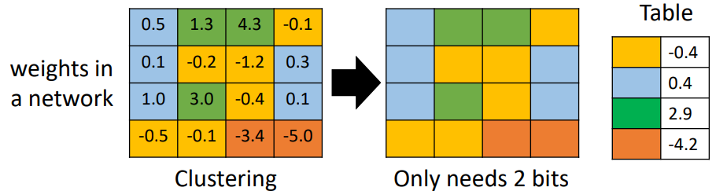

   - 最极端的情况，参数只有 1 和 -1 两种情况，即只是用一个 bit 表示参数即可【Binary Network】
     - 相关论文：[论文1](https://arxiv.org/abs/1602.02830)，[论文2](https://arxiv.org/abs/1511.00363)，[论文3](https://arxiv.org/abs/1603.05279)，[论文4](https://arxiv.org/abs/1511.00363)

# 四、Architecture Design

> 通过网络架构的重新设计来减少参数量
>
> 比如使用 Depthwise Separable Convolution 来替代标准的卷积

### 标准卷积

- 原始的 feature map 是 2*6*6；卷积核是 2*3*3，如果输出的 channel 数量为 4，则参数量为 72

  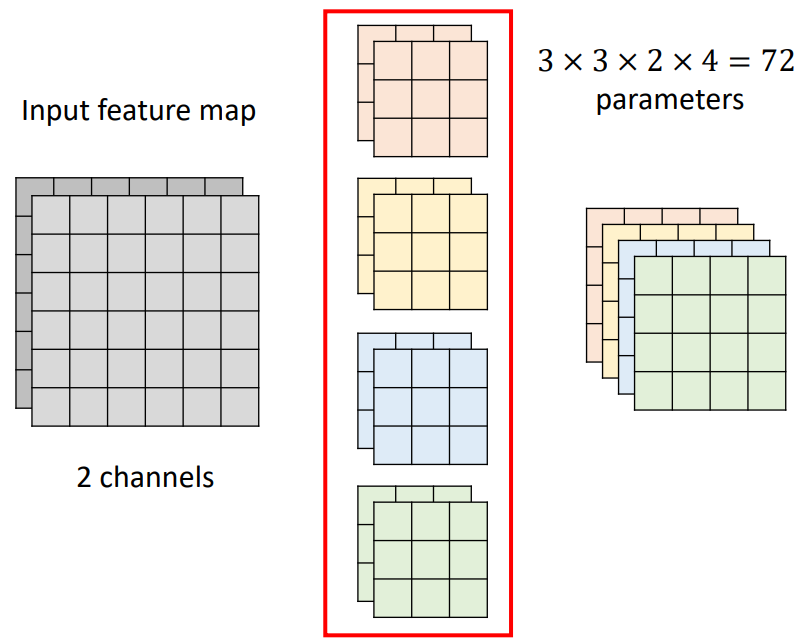

### Depthwise Separable Convolution

- 这种方法中，分为两步：

  1. 第一步的 Depthwise Convolution 中，原始的 feature map 有多少的 channel，就有多少个卷积核，而每一个卷积核都是只负责对应的channel，如下图所示，深蓝色的卷积核只负责深灰色的 feature map 的channel，而浅蓝色的卷积核只负责浅灰色的channel
  2. 第二步的 Pointwise Convolution 与标准的卷积类似，但是不同点是这里面所有的卷积核大小都是 num_of_channel*1*1

- 最终要想输出同样大小的结果，需要的参数量为 26

  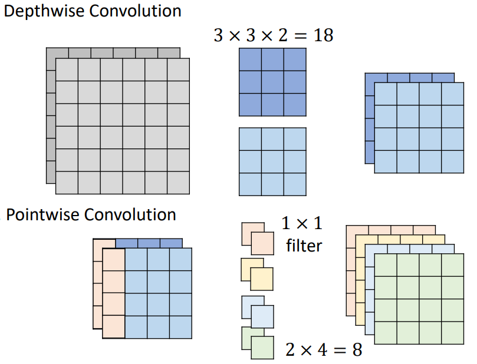

# 五、Dynamic Computation

这种方法的目标是可以自主调整运算量

1. 自主调节模型的深度【[Multi-Scale DenseNetwork (MSDNet)](https://arxiv.org/abs/1703.09844)】

   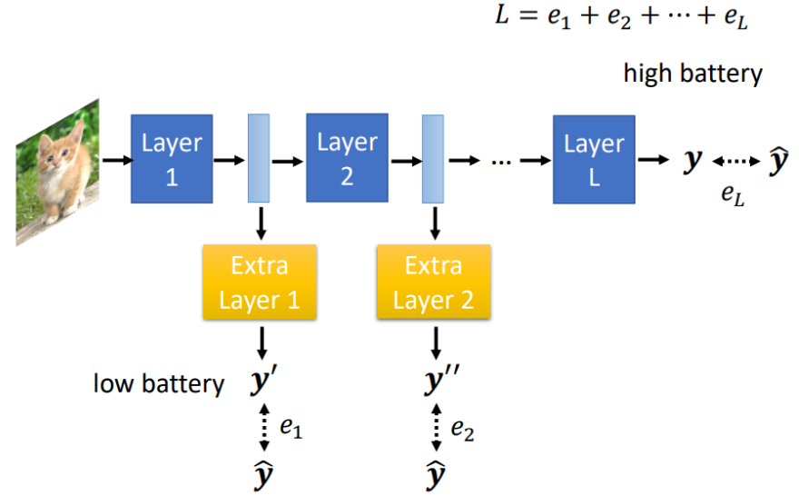

2. 自主调节模型的宽度【[Slimmable Neural Networks](https://arxiv.org/abs/1812.08928)】

   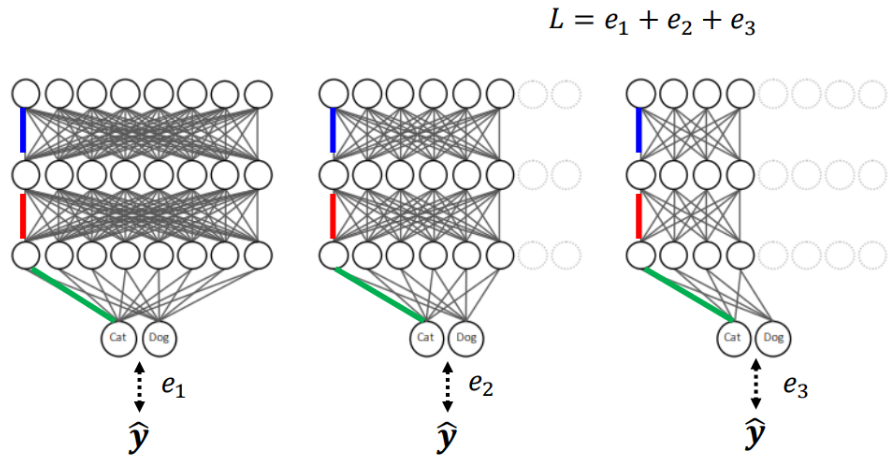

3. 根据任务的难易程度自主调整

   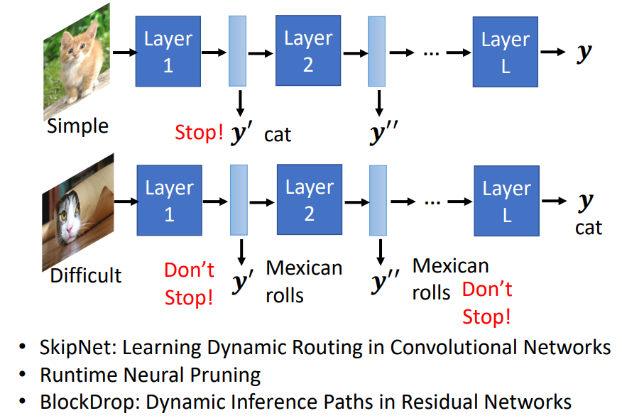

# Reference

1. [李宏毅课件：【機器學習2021】神經網路壓縮 (Network Compression) (一) - 類神經網路剪枝 (Pruning) 與大樂透假說 (Lottery Ticket Hypothesis)](https://www.youtube.com/watch?v=utk3EnAUh-g&list=PLJV_el3uVTsMhtt7_Y6sgTHGHp1Vb2P2J&index=36)
2. [【经典简读】知识蒸馏(Knowledge Distillation) 经典之作](https://zhuanlan.zhihu.com/p/102038521)
3. [Knowledge Distillation（知识蒸馏）Review--20篇paper回顾](https://zhuanlan.zhihu.com/p/160206075)
4. [万字综述 | 一文读懂知识蒸馏](https://cloud.tencent.com/developer/article/1763873)
5. [知识蒸馏](https://www.yuque.com/yahei/hey-yahei/knowledge_distillation)
6. [【论文】Distilling the Knowledge in a Neural Network](https://arxiv.org/pdf/1503.02531.pdf)