> 对于模型泛化能力的评估 ，不仅需要有效的实验方法，还要有行之有效的评价标准，即性能度量（performance measure）

> **模型性能度量反映了任务需求**，对比不同模型的能力时，使用不同的性能度量往往会导致不同的评判结果
>
> **这意味着模型的"好坏"是相对的**，什么样的模型是好的，不仅取决于算法和数据，还决定于任务需求.

模型评估的指标可以按照不同的任务进行分类，主要包括：

- **分类任务**评估指标：准确率（Accuracy）、精确率（Precision）、召回率（Recall）、PR 曲线、F1 值、ROC 曲线、AUC、对数损失
- **回归任务**评估指标：平均绝对误差（MAE）、均方误差（MSE）、均方根误差（RMSE）、归一化均方根误差（NRMSE）、决定系数（R2）
- **聚类任务**评估指标：纯度、NMI、兰德系数、调整兰德系数
- 目标检测任务评估指标：IOU

# 一、分类任务评估指标

- 在介绍分类评估指标之前先介绍一下混淆矩阵，这在很多分类评估指标中都会涉及

  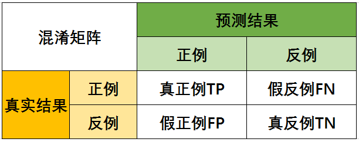

## 1）准确率（Accuracy）

- 准确率表示：**正确分类的样本个数占总样本个数**

- 计算方法：
  $$
  Accuracy = \frac{TP+TN}{TP+FP+TN+FN}
  $$

- 多分类计算方法：
  $$
  acc(f; D) = {1 \over m}{m \atop {\sum \atop i=1}}(f(x_i)=y_i)
  $$

  - 上面是离散的情况，对于连续的情况，可以使用概率密度的积分；

## 2）精确率（Precision）

- 精确率：**预测正确的正例数据占预测为正例数据的比例，**也称之为**查准率**

- 计算方法：
  $$
  Precision=\frac{TP}{TP+FP}
  $$

## 3）召回率（Recall）

- 召回率（Recall）：**预测为正确的正例数据占实际为正例数据的比例，**也称之为**查全率**

- 计算方法：
  $$
  Recall = \frac{TP}{TP+FN}
  $$

## 4）PR 曲线与 F1 值

- PR 曲线的绘制方法：

  1. 将样本按照预测为正例的概率的大小，从大到小进行排序
  2. 按照顺序遍历所有样本
  3. 在遍历到一个样本的时候，将当前样本预测概率当做阈值，大于这个阈值为正例，否则为负例
  4. 这样，在遍历每一个样本的时候都可以得到一个查准率和查全率作为坐标。当遍历完毕以后，就可以将这些坐标绘制为一条曲线，即 PR 曲线

- **查准率和查全率是一对矛盾，一般来说，查准率高的时候，查全率低；查全率高的时候，查准率低；**但是可以绘制查准率和查全率的曲线图（PR 曲线）

  1. 当一个学习器的P-R曲线被另一个学习器的曲线**完全包围**，则后者的性能必定优于前者，如下图中学习器 A 的性能优于学习器 C
  2. 当两个学习器的曲线发生了**相交**，则不能笼统地说哪一个学习器的性能更好，只能在具体的查准率和查全率下进行比较
  3. 当必须进行比较的时候，学习器的P-R曲线包裹的“面积”，是一个常见的参考值；

  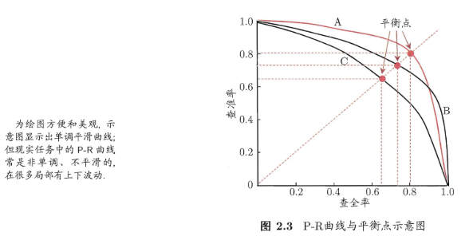

- 为了便于比较两个学习器之间的优劣，特别是当两个学习器的P-R曲线相交的时候，有下面的几种方式：

  1. **平衡点：这个表示“查全率=查准率”时的取值**。值越大，可以说学习器的性能就越好；

  2. 更常用的是 F1 值：【使用调和平均数，因为它更重视较小值】
     $$
     F1 =\frac{2*Precision(P)*Recall(R)}{Precision(P)+Recall(R)} = {2 *TP \over 样本总数 + TP -TN}
     $$

     $$
     {1 \over F1} = {1 \over 2}({1 \over P} + {1 \over R})
     $$

  3. 在实际的应用的过程中，人们对于查准率和查全率的重视程度是不一样的，从而有更一般的形式：

     - β 度量了查全率对查准率的相对重要性，β>1 表示查全率影响更大；β<1 查准率影响更大；

     $$
     F_\beta = {(1 + \beta ^ 2) * P * R \over (\beta ^ 2 * P) + R}
     $$

     $$
     {1 \over F_\beta} = {1 \over 1 + \beta ^ 2} ({1 \over P}+ {\beta ^ 2 \over R} )
     $$

  4. 当有多组的时候，可以有两种计算的方法：

     - 计算宏查全率、宏查准率和宏F1；【先分别计算查全率和查准率，求平均值】
     - 计算微查全率、微查准率和微F1；【先分别计算平均的FP、TP、FN和TN，根据平均值计算】

## 5）ROC 与 AUC

### 5.1 背景

> 很多学习器是为测试样本产生一个实值或概率预测，然后将这个预测值与 一个分类阈值(threshold)进行比较，若大于阈值则分为正类，否则为反类

- 一般情况下，使用神经网络模型，会给测试样本预测一个 [0, 1] 区间的实值，之后将这个值与阈值进行比较
- 根据这个实值或者概率预测结果，可以**将测试样本进行排序**：
  - 将“最可能”是正例的排在前面
  - 将“最不可能”是正例的排在后面
  - 这样，分类过程就相当于在这个排序中，**以某一个“截断点”将样本分为两部分**，前一部分判断为正例，后一部分判断为负例
- 在不同的任务中可以根据任务需求采取不同的截断点：
  - 如果重视查准率，可选择排序中靠前的位置进行截断；
  - 如果重视查全率，则可以选择排序中靠后的位置进行截断；
- 因此，**排序本身的质量好坏，体现了综合考虑学习器在不同任务下的"期望泛化性能"的好坏**，或者说"一般情况 下"泛化性能的好坏。ROC 曲线就是从这个角度出发来研究学习器泛化能力的工具

### 5.2 ROC 与 AUC 详解

> ROC 全称是"受试者工作特征" (Receiver Operating Characteristic) 曲线

- ROC 曲线：

  - **绘制方法**：

    1. 将所有样本按照预测为正例的概率的大小，从大到小进行排序
    2. 遍历所有的样本
    3. 在遍历一个样本的时候，将当前样本概率作为阈值，即截断点，分别计算真正例率（TPR）和假正例率（FPR）作为纵轴和横轴坐标
    4. 将得到的坐标点连起来，绘制成为 ROC 曲线

  - 纵轴，真正例率的计算：
    $$
    TPR=\frac{TP}{TP+FN}
    $$

  - 横轴，假正例率的计算：
    $$
    FPR=\frac{FP}{FP+TN}
    $$

- ROC 曲线和 AUC 示意图：

  1. 对角线对应于“随机猜想”模型
  2. 点 (0, 1) 对应于将所有正例放在所有反例之前的“理想模型”

  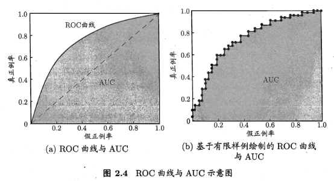

- **不同 ROC 曲线的含义**：

  1. AUC = 1，是完美分类器，采用这个预测模型时，存在至少一个阈值能得出完美预测。绝大多数预测的场合，不存在完美分类器。
  2. 0.5 < AUC < 1，优于随机猜测。这个分类器（模型）妥善设定阈值（比如0.5）的话，能有预测价值。
  3. AUC = 0.5，跟随机猜测一样（例如：抛硬币猜正反面），模型没有预测价值。
  4. AUC < 0.5，比随机猜测还差；但只要总是反预测而行，就优于随机猜测。

  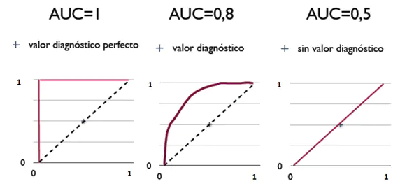

- **模型的比较：**

  1. 与 P-R 图相似， 若一个学习器的 ROC 曲线被另一个学习器的曲线完全"包住"，则可以断定后者的性能优于前者
  2. 如果发生交叉，则难以一般性地说哪一个更好，此时如果要进行比较，一般使用 ROC 曲线下的面积，即 AUC（Area Under ROC Curve）

- 确定最有零界点：

  > 即保证TPR高的同时FPR要尽量的小，建立max（TPR+（1-FPR））的模型

  1. 找到离（0,1）最近的点
  2. Youden index : 最大化ROC曲线上的点到x轴的垂直距离（最大化TPR(Sn)和FPR(1-Sp)的差异）；
  3. 考虑人力物力和财力（第三种方法很少用，因为很难评估）

  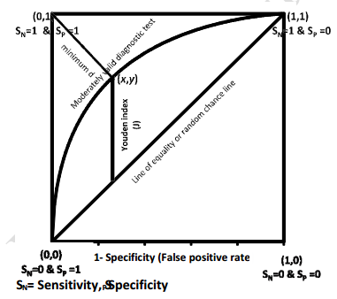

### 5.3 PR 曲线与 ROC 曲线的比较

1. PR 曲线越靠近右上角越好；ROC 曲线越靠近左上角越好

2. PR 曲线不适合于不平衡样本，而 ROC 曲线对样本不均衡不敏感，即**ROC 曲线的形状并不会随着正负样本分布的变化而产生很大的变化**

   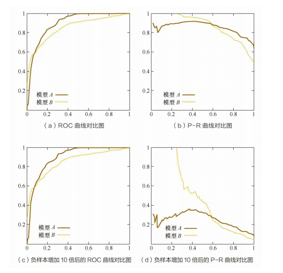

### 5.4 AUC 的计算方法

1. 根据 ROC 曲线：

   - AUC 是 ROC 曲线下的面积，显然可以通过 ROC 曲线计算 AUC
   - 因为测试样本量是有限的，因此 ROC 曲线就是阶梯状
   - 因此，计算这些阶梯的面积之和即可

2. 从AUC统计意义去计算：

   > AUC 的一个性质就是和 Wilcoxon-Mann-Witney Test是等价的。即：**分别随机从正负样本集中抽取一个正样本，一个负样本，正样本的预测值大于负样本的概率**

   - 计算方法：

     **分母是正负样本总的组合数，分子是正样本大于负样本的组合数**
     $$
     A U C=\frac{\sum \text { pred }*{\text {pos }}>\text { pred }*{\text {neg }}}{\text { positiveNum } * \text { negaitiveNum }}
     $$

3. 第三种方法与第二种方法原理上是 一样的，但是降低了时间复杂度（假设正样本数目为 M，负样本数目为 N）：

   - 对样本预测值 score，从大到小进行排序，则最大 score 的样本对应的 rank 为 n = M + N，第二大的 score 对应的 rank 为 n-1，以此类推

   - 将所有正例对应的 rank 累加

   - 减去两个正样本组合的情况，除以 M * N 即可

   - 计算公式：
     $$
     A U C=\frac{\sum_{i \in \text { positiveClass }} \operatorname{rank}_{i}-\frac{M(1+M)}{2}}{M \times N}
     $$
     

## 6）对数损失（LogLoss）

> LogLoss衡量的是预测概率分布和真实概率分布的差异性，取值越小越好；

- 相当于 AUC，LogLoss 对预测概率敏感，经常作为模型的损失函数来优化模型

- 但是，当样本不均衡的时候（负例 >> 正例），如果不做任何处理，直接使用对数损失，则模型偏向于样本量比较大的分类（负例），即 LogLoss 很低，但是实际效果很差。

- 计算方法：
  $$
  \text { LogLoss }=-\frac{1}{n} \sum_{i}\left[y_{i} \log \left(y_{i}^{\prime}\right)+\left(1-y_{i}\right) \log \left(1-y_{i}^{\prime}\right)\right]
  $$

# 二、回归任务评价指标

## 1）平均绝对误差（MAE）

> 平均绝对误差的英文全称为 Mean Absolute Error，也称之为 L1 范数损失。是通过计算预测值和真实值之间的距离的绝对值的均值，来衡量预测值与真实值之间的距离

- 计算方法：
  $$
  MAE=\frac{1}{N} \sum_{i=1}^N |y_i-f(x_i)|
  $$

## 2）均方误差（MSE）

> 均方误差英文全称为 Mean Squared Error，也称之为 L2 范数损失。通过计算真实值与预测值的差值的平方和的均值来衡量距离

- 计算方法：
  $$
  MSE = {1 \over m} {\sum_{i-1}^m} (f(x_i) - y_i)^2
  $$

- MSE 对离群点比较敏感

## 3）均方根误差（RMSE）

> 均方根误差的英文全称为 Root Mean Squared Error，代表的是预测值与真实值差值的样本标准差

- 计算方法：
  $$
  RMSE=\sqrt{{1 \over N} \sum_{i=1}^N (y_i-f(x_i))^2}
  $$

- 和 MAE 相比，RMSE 对大误差样本有更大的惩罚

- 但它对离群点敏感，其健壮性不如 MAE

## 4）决定系数（R2）

> 决定系数评估的是预测模型相对于基准模型（真实值的平均值作为预测值）的好坏程度

- 为什么使用均值作为基准预测模型？

  - 当我们只有真实值的标签的时候，我们要对标签进行预测，显然，我们这时候一个最好的选择就是将均值作为我们的预测值
  - 但是当我们存在一些 features 来帮助我们来进行预测，显然，应该得到比之前更好的结果

- 计算方法：
  $$
  \begin{gathered}R^{2}\left(y_{\text {true }}, y_{\text {pred }}\right)=1-\frac{\sum\left(y_{\text {true }}-y_{\text {pred }}\right)^{2}}{\sum\left(y_{\text {true }}-\bar{y}\right)^{2}} \\\bar{y}=\frac{1}{n_{\text {samples }}} \sum y_{\text {true }}\end{gathered}
  $$

  - 分子表示预测值与真实值差值的平方和
  - 分母表示真实值与真实值均值差值的平方和

- 绝大多数的教材中，会讲决定系数的范围是 [0, 1]，但是这个结论是部分正确的：

  1. 最好的模型预测的 R2 的值为 1，表示预测值与真实值之间是没有偏差的；
  2. 但是最差的模型，得到的 R2 的值并不是 0，而是会得到负值；
  3. 当模型的 R2 值为负值，表示模型预测结果比基准模型（均值模型）表现要差
  4. 当模型的 R2 值大于 0，表示模型的预测结果比使用均值预测得到的结果要好，即预测结果比使用下面的红色直线进行预测要好

  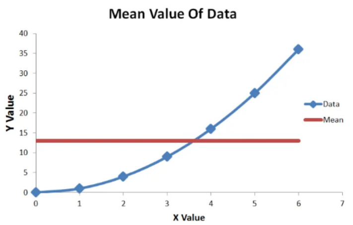

# 三、聚类评估指标

> 聚类常用评估指标：`纯度（Purity）`、`NMI（Normalized Mutual Information）`、`兰德系数（Rand Index，RI）`，`F 值（F-score）`以及`调整兰德系数（Adjusted Rand Index，ARI）`

## 1）基本背景

假设：

​	现在有一批文档一共包含有叉形、圆形与菱形三个类别；

结果：

使用某一种聚类方法得到的结果如 图1 所示：

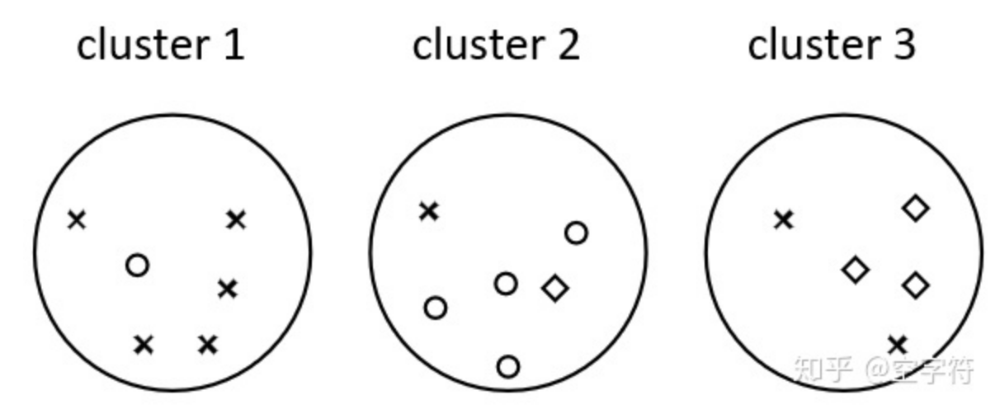

## 2）纯度（purity）

- 纯度实际上和有监督学习中准确率非常的相似；
  - 基本的思想也是用聚类正确的样本数量除以总的样本数量
- 但是，无监督学习中没有真实的标签，并不知道每一个簇对应的真实类别，所以取每一种情况下的最大值

### 2.1 计算公式

$$
P=(\Omega, \mathbb{C})=\frac{1}{N} \sum_{k} \max *{j}\left|\omega*{k} \cap c_{j}\right|
$$

说明：

1. N：总的样本数量
2. $\Omega=\left\{\omega_{1}, \omega_{2}, \ldots, \omega_{K}\right\}$：表示聚类之后的簇
   - $w_k$：第 k 个簇中所有的样本
   - $c_j$：第 j 个类别中真实的样本
3. $\mathbb{C}=\left\{c_{1}, 2, \ldots c_{J}\right\}$：表示正确的分类

### 2.2 举例说明

> 本质上，因为簇没有名称，所以就让簇与每一个类求交集，得到一个最大值，让这些最大值累加，除以所有样本数，就是最终的纯度（purity）

- 对于 cluster1 来说，与每一个类求交集，得到：$\left|\omega_{1} \cap c_{1}\right|=5, \quad\left|\omega_{1} \cap c_{2}\right|=1, \quad\left|\omega_{1} \cap c_{3}\right|=0$ ；最大值是 5；
- 同理，cluster2 和 cluster3 分别得到 4 和 3；
- 因此，最终的纯度就是：$P=\frac{5+4+3}{17}=0.706$

## 3）NMI（归一化互信息）

- 基础知识:

  [信息熵 & 互信息](https://www.notion.so/24d6c23751b144238df7e65f0618d663)

计算方法：
$$
\operatorname{NMI}(\Omega, C)=\frac{2*I(\Omega ; C)}{H(\Omega)+H(C)}
$$

- 其中 I 表示互信息（Mutual Information），计算方法：
  $$
  \begin{aligned} I(\Omega ; C) &=\sum_{k} \sum_{j} P\left(w_{k} \cap c_{j}\right) \log \frac{P\left(w_{k} \cap c_{j}\right)}{P\left(w_{k}\right) P\left(c_{j}\right)} \\ &=\sum_{k} \sum_{j} \frac{\left|w_{k} \cap c_{j}\right|}{N} \log \frac{N\left|w_{k} \cap c_{j}\right|}{\left|w_{k}\right|\left|c_{j}\right|} \end{aligned}
  $$

- H 表示信息熵；当 log 以 2 为底，单位是 bit，当以 e 为底，单位是 nat；计算方法：
  $$
  \begin{aligned} H(\Omega) &=-\sum_{k} P\left(w_{k}\right) \log P\left(w_{k}\right) \\ &=-\sum_{k} \frac{\left|w_{k}\right|}{N} \log \frac{\left|w_{k}\right|}{N} \end{aligned}
  $$
  

## 4）兰德系数（RI）& F 值

还是采用上面的例子：

### 4.1 基本原理

首先进行如下说明：

1. 从同一个簇中，任意取出两个样本都是同一个类别，就表示这个簇中的所有样本都是聚类正确的；
2. 从同一个簇中，任意取出两个样本存在不同的类别，就表示这个簇中存在聚类错误的情况；
3. 从两个不同的簇中，任意取两个样本，都是不同的分类，就表示这两个簇分类都是正确的；
4. 从两个不同的簇中，任意取两个样本，存在相同的分类，就表示存在聚类错误的情况；

类比于混淆矩阵，可以进行下面的定义：

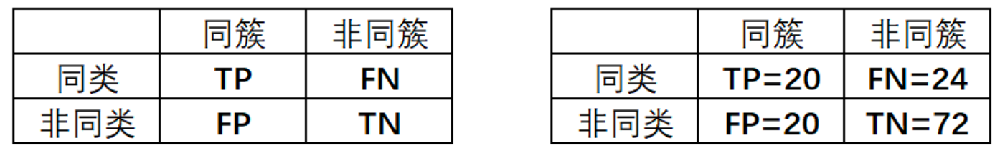

1. TP：表示两个同类样本点在同一个簇中的情况数量；
2. FP：表示两个非同类样本点在同一个簇中的情况数量；
3. TN：表示两个非同类样本点分别在两个簇中的情况数量；
4. FN：表示两个同类样本点分别在两个簇中的情况数量；

上图中右半部分是本文例子计算出来的混淆矩阵

### 4.2 计算方法

根据混淆矩阵的统计情况，就可以进行下面的计算来求得 RI 和 F 值
$$
\begin{aligned} R I &=\frac{T P+T N}{T P+F P+F N+T N} \\ \text { Precision } &=\frac{T P}{T P+F P} \\ \text { Recall } &=\frac{T P}{T P+F N} \\ F_{\beta} &=\left(1+\beta^{2}\right) \frac{\text { Precision } \cdot \text { Recall }}{\beta^{2} \cdot \text { Precision }+\text { Recall }} \end{aligned}
$$

## 5）调整兰德系数（ARI）

`调整兰德系数`是兰德系数的一个改进版本，目的是为了去掉随机标签对于兰德系数评估结果的影响。

随机标签即：如上面的例子中，一共 17 个样本，如果分成 17  个簇，RI 依然有 0.68

### 5.1 原理

如图4 所示：

- Y 表示聚类的结果
- X 表示手动聚类的结果

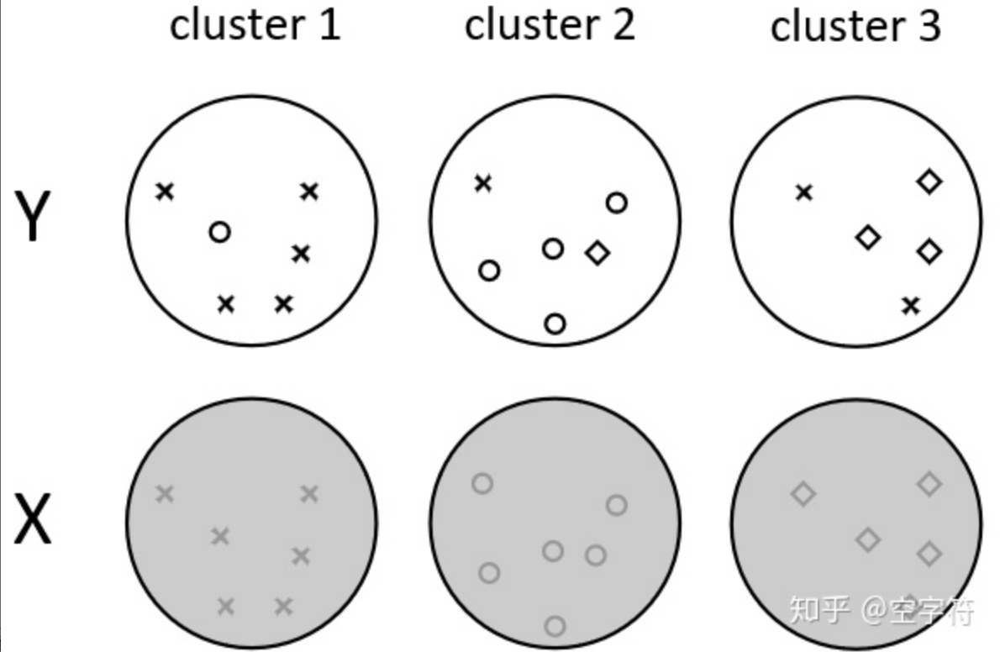

图4

根据上面的聚类结果和真实的、手动聚类，可以得到下面的表格

- 图5 左图中，$X_r$ 表示第 r 个簇；$Y_s$ 表示手动结果的第 s 个簇
- 图5 右图是根据左图的方法，从上例中计算的结果

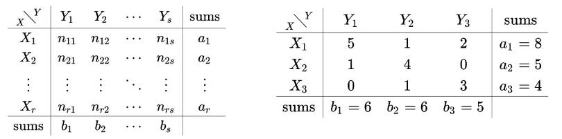

图5

### 5.2 计算方法

$$
A R I=\frac{\sum_{i} \sum_{j}\left(\begin{array}{c} n_{i j} \\ 2 \end{array}\right)-\left[\sum_{i}\left(\begin{array}{c} a_{i} \\ 2 \end{array}\right) \sum_{j}\left(\begin{array}{c} b_{j} \\ 2 \end{array}\right)\right] /\left(\begin{array}{c} n \\ 2 \end{array}\right)}{\frac{1}{2}\left[\sum_{i}\left(\begin{array}{c} a_{i} \\ 2 \end{array}\right)+\sum_{j}\left(\begin{array}{c} b_{j} \\ 2 \end{array}\right)\right]-\left[\sum_{i}\left(\begin{array}{c} a_{i} \\ 2 \end{array}\right) \sum_{j}\left(\begin{array}{c} b_{j} \\ 2 \end{array}\right)\right] /\left(\begin{array}{c} n \\ 2 \end{array}\right)}
$$

- ARI  的取值范围是[-1, 1]，越大表示效果越好

- 其中的 $\left(\begin{array}{c} n_{i j} \\ 2 \end{array}\right)$ 表示的是排序，即从 $n_{ij}$ 个样本中取 2 个进行排序，即 $A_{n_{ij}}^2$

- 上例中的结果：
  $$
  A R I=\frac{20-44 \times 40 \div 136}{0.5 \times(44+40)-44 \times 40 \div 136}=\frac{120}{494} \approx 0.24
  $$

# 四、目标检测评估指标

## 1）IOU

> IOU 称之为交并比（Intersection over Union）。含义：**预测框与标注框的交集与并集之比**，数值越大表示该检测器的性能越好

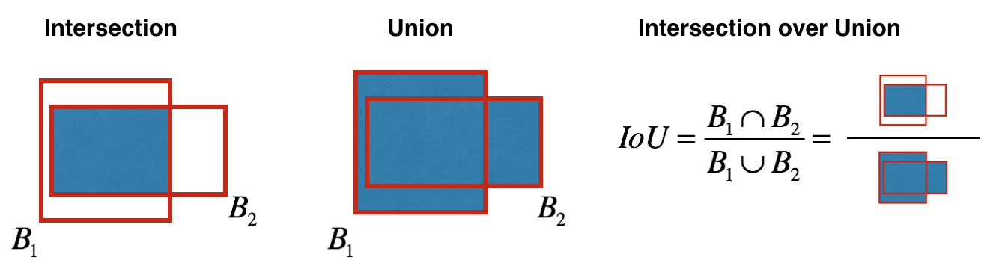

# Reference

1. 深度学习（周志华，西瓜书）【主要参考】
2. [详解模型评估指标](https://zhuanlan.zhihu.com/p/108475675)
3. [机器学习模型评估指标](https://zhuanlan.zhihu.com/p/86120987)
4. [模型评估指标](https://www.jianshu.com/p/ce70c716c9d1)
5. [常用的模型评估指标](https://www.plob.org/article/13192.html)
6. **[全面了解ROC曲线](https://www.plob.org/article/12476.html)【总结的非常好】**
7. [几种常见的聚类评价指标](https://zhuanlan.zhihu.com/p/343667804)
8. [如何评估聚类有效性](https://zhuanlan.zhihu.com/p/35800874)【还需要总结】
9. [比较好的方法总结](https://www.biaodianfu.com/cluster-score.html)
10. **[Evaluating a machine learning model](https://www.jeremyjordan.me/evaluating-a-machine-learning-model/)【还不错】**
11. [What Is R Squared And Negative R Squared](http://www.fairlynerdy.com/what-is-r-squared/)【解释决定系数，[中文翻译](https://zhuanlan.zhihu.com/p/142162339)】
12. [面试篇——机器学习中的评估指标](https://mp.weixin.qq.com/s/pxoApHxMLJRRshDsnY4Kqg)
13. [AUC的理解与计算](https://zhuanlan.zhihu.com/p/37576578)【广告领域，针对 AUC 有更新】