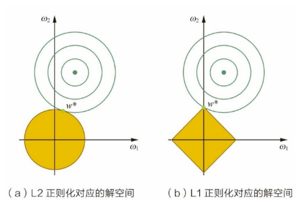
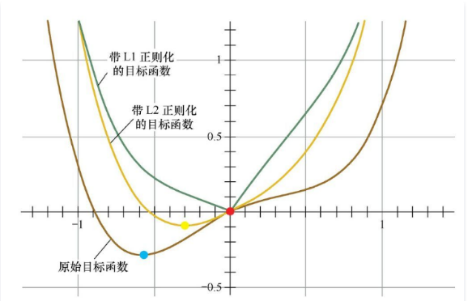
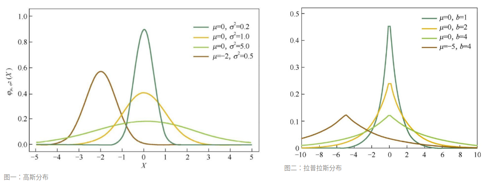

> 过拟合问题是目前机器学习中面临的主要问题之一，处理过拟合问题主要有两种解决方案，一种是**增加训练样本的数量**，另一种是**减少模型的复杂度**
>
> 正则化是减少模型复杂度的有效方法之一，常用的是 L1 和 L2 正则化。L1 和 L2 都可以作为**损失函数**和**正则项**，这篇文章主要介绍 L1 和 L2 作为正则项的异同

## 1）关于 L1 和 L2 正则项的定义

### 1. L1 正则项

1. 方法：定义为**参数绝对值之和**。是在正常的 Loss 后面添加参数的绝对值之和作为正则项：
   $$
   \min \frac{1}{2 m} \sum_{i=1}^{n}\left(h_{w}\left(x^{(i)}\right)-y^{(i)}\right)^{2}+\lambda \sum_{j=1}^{2}\left|w_{j}\right|
   $$

2. 作用：将会产生稀疏权值矩阵，

   1. 即产生**稀疏解**，方便进行**特征的选择，将不重要的特征去掉**
   2. 在稀疏情形下计算效率比较高

### 2. L2 正则项

1. 方法：定义为参数平方和。是在正常的 Loss 后面添加参数的平方和作为正则项：
   $$
   \min \frac{1}{2 m} \sum_{i=1}^{n}\left(h_{w}\left(x^{(i)}\right)-y^{(i)}\right)^{2}+\lambda \sum_{j=1}^{2} w_{j}^{2}
   $$

2. 作用：参数矩阵的取值趋近于 0，即**平滑解**

   1. 可以降低特征的贡献
   2. 计算效率高

### 3. 对比

1. 从优化的角度：
   1. L1 正则化容易产生**稀疏矩阵**，即参数容易是 0
   2. L2 正则化容易产生**平滑矩阵**，即参数尽可能小，但是不是 0
2. 从先验角度：
   1. L1 正则化引入**拉普拉斯分布**
   2. L2 正则化引入**高斯分布**
3. PRML 的图形角度分析
   1. L1 正则化在零点附近有明显的棱角
   2. L2 正则化则在 0  附近比较平缓
4. 梯度角度：
   1. L1 正则化：当参数 w>0 的时候，L1 会使得其变小，反之变大，容易使得参数变为 0
   2. L2 正则化：当 w → 0 的时候，参数减少的非常缓慢，使得参数减小到很小的范围，但是不为 0
   3. 因为只考虑正则项，L1 是顶点在原点的两个射线组成，而 L2 则是一条抛物线

## 2）L1 正则化为什么得到稀疏解

### 1. 解释一：解空间的形状

1. 首先看看 L2 正则和 L1 正则对应的解空间的形状

   

2. 上图中黄色区域就是两个正则化对应的解空间

   - 所谓解空间就是这个区域内的都可以任务是正确的解
   - 其中 $\omega_1$ 和 $\omega_2$ 分别是假设存在的两个参数；L2 正则化相当于为参数定义了一个**圆形**的解空间，而 L1 正则化相当于为参数定义了一个**菱形**的解空间
   - 绿色的圆则是目标函数
   - 对于 L1 来说，更容易是尖角的点（$\omega_1=0$）与目标函数贴合；即 L1 “棱角分明”的解空间显然更容易与目标函数等高线在脚点碰撞，从而产生稀疏解。

### 2. 解释二：函数叠加

1. 考虑一维的情况，横轴是参数的值，纵轴是损失函数，加入正则项之后，损失函数曲线图变化如下：

   

2. 可以看到，在加入 L1 正则项后，最小值在红点处，对应的 w 是 0。而加入 L2 正则项后，最小值在黄点处，对应的 w 并不为 0。

3. 原因分析：

   1. 加入 L1 正则项后，目标函数变为 L(w)+C|w|，**单就正则项部分求导**，原点左边的值为`-C`，原点右边的值为`C`，
   2. 因此，只要原目标函数的导数绝对值`|L'(w)|<C`，那么带 L1 正则项的目标函数在原点左边部分始终递减，在原点右边部分始终递增，最小值点自然会出现在原点处。
   3. 加入L2正则项后，目标函数变为 $L(\omega) + C \omega^2$，只要原目标函数在原点处的导数不为 0，那么带L2正则项的目标函数在原点处的导数就不为0，那么最小值就不会在原点。因此L2正则只有减小 w 绝对值的作用，但并不能产生稀疏解。

### 3. 解释三：贝叶斯先验

> 从贝叶斯角度来看，**L1 正则化**相当于对模型参数 w 引入了**拉普拉斯先验**，**L2 正则化**相当于引入了**高斯先验**

1. 观察拉普拉斯分布和高斯分布：

   

2. 结论

   1. 当均值为0时，高斯分布在极值点处是平滑的，也就是高斯先验分布认为 w 在极值点附近取不同值的可能性是接近的

   2. 但对拉普拉斯分布来说，其极值点处是一个尖峰，所以拉普拉斯先验分布中参数 w 取值为 0 的可能性要更高

      

## 3）正则化防止过拟合的原理

1. 产生过拟合的原因就是模型过于复杂，学习能力太强，学习到了一些噪声；
2. 正则化就是控制模型空间的一种办法。正则化能够在保证模型有效的前提下使得模型简单，而越简单的模型泛化能力越强

# Reference

1. [面试篇——机器学习综合面试题](https://mp.weixin.qq.com/s/n0PnYejQMAjWhv2ThDNVyA)
2. [带答案面经分享-L1正则&L2正则](https://cloud.tencent.com/developer/article/1456966)
3. [l1 相比于 l2 为什么容易获得稀疏解？](https://www.zhihu.com/question/37096933/answer/70494622)
