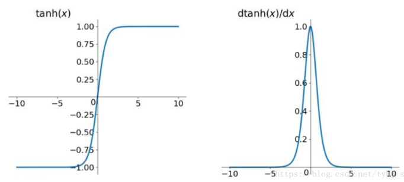

> 为了避免深度神经网络只作为一种深度线性分类器，必须要加入激活函数以希望其**拥有非线性拟合的能力**

# 一、Sigmoid

> sigmoid 函数是一个 logistic 函数，意思就是说：不管输入是什么，得到的输出都在 0 到 1 之间。

$$
\operatorname{sigmoid}(x)=\sigma=\frac{1}{1+e^{-x}}
$$

1. 图像：

   

2. 特点：

   - 它能够把输入的连续实值变换为0和1之间的输出；如果是非常大的负数，那么输出就是0；如果是非常大的正数，输出就是1
   - 使用sigmoid作为损失函数，其梯度是不可能超过0.25的

3. 缺点：

   - Sigmoid函数饱和使**梯度消失**。当神经元的激活在接近0或1处时会饱和，在这些区域梯度几乎为0，这就会导致梯度消失，几乎就有没有信号通过神经传回上一层
   - 其解析式中含有幂运算，计算机求解时相对来讲比较耗时
   - Sigmoid函数的**输出不是零中心的**。因为如果输入神经元的数据总是正数，那么关于 $w$ 的梯度在反向传播的过程中，将会要么全部是正数，要么全部是负数，这将会导致梯度下降权重更新时出现 z 字型的下降。

# 二、Tanh 激活函数

> tanh，即**双曲正切**（hyperbolic tangent），类似于幅度增大sigmoid，将输入值转换为 **-1 至 1** 之间

1. 公式：
   $$
   y=\tanh (x)=\frac{e^{x}-e^{-x}}{e^{x}+e^{-x}}
   $$

2. Tanh 函数以及导数图像：

   

3. 优点：

   - 比Sigmoid函数收敛速度更快
   - 相比Sigmoid函数，其输出以0为中心，即 (-1, 1)，而不是 (0, 1)

4. 缺点：

   - 还是存在饱和性**梯度消失**的问题

# 三、ReLU（Rectified Linear Unit）

> RELU 是人工神经网络中最常用的激活函数（activation function）

1. 函数表达式： $f(x) = max(0,x)$

2. 函数图像：

   

3. 优点：

   1. 可以有效缓解梯度消失或者爆炸的问题
   2. 计算效率较高，因为 sigmoid 和 tanh 中包含指数运算
   3. **收敛速度快**于 sigmoid 和 tanh

4. 缺点：

   - 引入了**死亡 ReLU 问题**，即由于负数部分恒为0，会导致一些神经元无法激活（可通过设置小学习率部分解决）
   - 输出不是以0为中心的

# 四、Leaky ReLU

1. 数学表达式：
   $$
   \operatorname{LReLU}(x)=\left\{\begin{array}{ll}x & \text { if } x>0 \\\alpha x & \text { if } x \leq 0\end{array}\right.
   $$

2. 图像：

   

3. 优点：

   1. Leaky ReLU 能**避免死亡 ReLU 问题**，因为其在计算导数时允许较小的梯度；
   2. 包含了 ReLU 的其他优点

4. 缺点：

   1. 引入超参数 $\alpha$
   2. 在微分时，两部分都是线性的；而 ELU 的一部分是线性的，一部分是非线性的。
   3. 理论上虽然好于ReLU，但在实际使用中目前并没有好的证据 Leaky ReLU 总是优于ReLU。

# 五、ELU (Exponential Linear Units)

1. 数学表达式：
   $$
   f(x)= \begin{cases}x, & \text { if } x>0 \\ \alpha\left(e^{x}-1\right), & \text { otherwise }\end{cases}
   $$

2. 函数以及导数图像：

   

3. 优点：

   - 继承ReLU优点，避免死亡ReLU的问题

4. 缺点：

   - 计算量稍大
   - 引入超参数 $\alpha$
   - 理论上虽然好于ReLU，但在实际使用中目前并没有好的证据ELU总是优于ReLU。

# 六、GELU(Gaussian Error Linear Unit)

> 在预训练语言模型中，GELU可以说是主流的激活函数；Bert，RoBERTa，ALBERT，GPT-2 等顶尖的 NLP 预训练模型都是使用的 GELU

> **GELU 可以看做是 RELU 的一个平滑版本**；GELU激活函数的最大特点是：**将非线性与依赖输入数据分布的随机正则化器相结合在一个激活函数的表达中** 
>
> 与以往 dropout 指定随机概率值或 ReLU 根据输入值的正负进行 mask 的方式不同，GELU根据当前 input 大于其余 inputs 的概率进行随机正则化

## 1）基础知识

1. 正态分布与正态分布累计函数

   

2. 函数表达式

   1. 概率密度函数：
      $$
      f(x)=\frac{1}{\sqrt{2 \pi} \sigma} \exp \left(-\frac{(x-\mu)^{2}}{2 \sigma^{2}}\right)
      $$

   2. 累积分布函数是指随机变量X小于或等于 x 的概率，用概率密度函数表示为：
      $$
      F(x ; \mu, \sigma)=\frac{1}{\sigma \sqrt{2 \pi}} \int_{-\infty}^{x} \exp \left(-\frac{(t-\mu)^{2}}{2 \sigma^{2}}\right) d t
      $$
      正态分布的累积分布函数可以用“误差函数” erf 表示：
      $$
      \Phi(z)=\frac{1}{2}\left[1+\operatorname{erf}\left(\frac{z-\mu}{\sigma \sqrt{2}}\right)\right]
      $$
      其中误差函数的表达式为：
      $$
      \operatorname{erf}(x)=\frac{1}{\sqrt{\pi}} \int_{-x}^{x} e^{-t^{2}} \mathrm{~d} t=\frac{2}{\sqrt{\pi}} \int_{0}^{x} e^{-t^{2}} \mathrm{~d} t
      $$

   3. 误差函数与标准正态分布的累积分布函数 $\Phi$ 的关系：
      $$
      \Phi(x)=\frac{1}{2}+\frac{1}{2} \operatorname{erf}\left(\frac{x}{\sqrt{2}}\right)
      $$


## 2）GELU 激活函数

> **GELU 实际上是结合了 dropout, zoneout 和 ReLU**

### GELU与ReLU, dropout, zoneout 之间的联系与区别

1. dropout 与 ReLU：ReLU中 Input 乘以一个 0 或者 1，所乘的值是确定的；dropout 也会乘以一个 0 或者 1，所乘的值是随机的；
2. zoneout：zoneout 是一个 RNN 正则化器，它会为inputs随机乘 1
3. GELU：GELU也会为 inputs 乘以 0 或者 1，
   - 但不同于以上的或有明确值或随机，GELU 所加的 0-1 mask 的值是随机的，同时是依赖于 inputs 的分布的。
   - 可以理解为：GELU的权值取决于当前的输入input有多大的概率大于其余的 inputs

### 表达式

1. 将input x 乘以一个服从伯努利分布的 m。而该伯努利分布又是依赖于输入Input x 的：
   $$
   m \sim \text { Bernoulli }(\Phi(x)), \text { where } \Phi(x)=P(X<=x)
   $$
   其中 X 是服从标准正态分布的

   GELU通过这种方式加 mask，**既保持了不确定性，又建立了与input的依赖关系**

2. GELU的表达式：
   $$
   G E L U(x)=x P(X \leq x)=x \Phi(x)=x \cdot \frac{1}{2}[1+\operatorname{erf}(x / \sqrt{2})]
   $$
   其近似为:
   $$
   G E L U(x)=0.5 x\left(1+\tanh \left[\sqrt{2 / \pi}\left(x+0.044715 x^{3}\right)\right]\right)
   $$
   

3. 代码实现：

   ```python
   def gelu(x):
     """Gaussian Error Linear Unit.
     This is a smoother version of the RELU.
     Original paper: <https://arxiv.org/abs/1606.08415>
     Args:
       x: float Tensor to perform activation.
     Returns:
       `x` with the GELU activation applied.
     """
     cdf = 0.5 * (1.0 + tf.tanh(
         (np.sqrt(2 / np.pi) * (x + 0.044715 * tf.pow(x, 3)))))
     return x * cdf
   ```

# Reference

1. [Gaussian Error Linear Units (GELUS) 论文地址](https://arxiv.org/pdf/1606.08415.pdf)
2. [[Deep Learning\] GELU (Gaussian Error Linerar Units)](https://www.cnblogs.com/shiyublog/p/11121839.html)
3. [BERT中的激活函数GELU：高斯误差线性单元](https://zhuanlan.zhihu.com/p/349492378)
4. [从ReLU到GELU，一文概览神经网络的激活函数](https://baijiahao.baidu.com/s?id=1653421414340022957&wfr=spider&for=pc)
5. [常用激活函数的比较](https://zhuanlan.zhihu.com/p/32610035)
6. [详解深度学习中的梯度消失、爆炸原因及其解决方法](https://zhuanlan.zhihu.com/p/33006526)
7. [常用激活函数进化史](https://www.peng.science/2020/02/11/常用激活函数进化史/)

