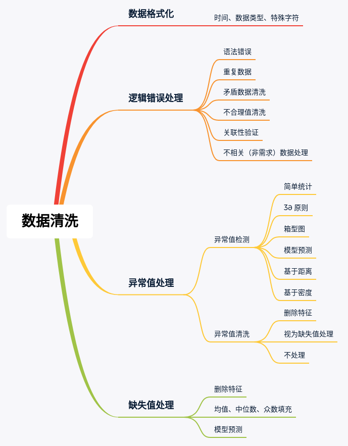
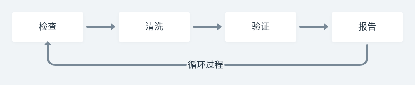
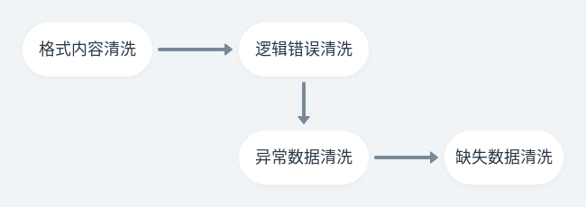
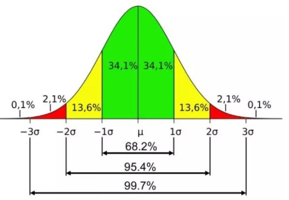
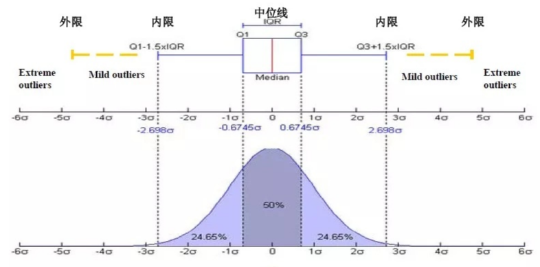
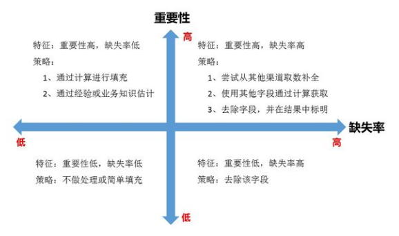
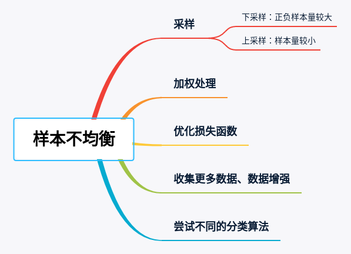

> 数据预处理是特征工程的第一步，需要主要分为两个部分：**数据清洗**和**处理样本不均衡**的问题

# 一、数据清洗

> **数据清洗即重新检查和验证数据的过程**。旨在删除重复信息，纠正现有错误并提供数据一致性。

- 数据清洗主要内容：

  1. 数据格式化
  2. 逻辑错误处理
  3. 缺失值处理
  4. 异常值处理

- 全景思维导图：

  

- 数据清洗的主要流程：

  

  1. **检查：**检测意外，不正确和不一致的数据。
     1. 数据描述：数据描述是关于数据的摘要统计信息，可以给出数据质量的一般信息
     2. 可视化：通过使用统计方法（例如均值，标准差，范围或分位数）分析和可视化数据，更加方便、直观地返现问题
  2. **清洗：**修复或删除发现的异常。
  3. **验证：**清洗后，通过重新检查数据并确保其规则和约束确实有效来验证正确性
  4. **报告：**记录有关所做更改和当前存储数据质量的报告。

- **下面主要介绍数据清洗部分，数据清洗的一般流程：**

  

## 1）数据格式化

> 格式的问题各种各样，五花八门，需要具体问题具体分析

1. 日期、时间、数值、全半角等显示格式不一致
2. 内容中有不该存在的字符
3. 内容与字段应有内容不符合
4. 对于字符串，确保所有值均为小写或大写

- 对于数值，确保存储为数字数据类型，并确保所有值都具有特定的度量单位

## 2）逻辑错误处理

1. **语法错误**：

   - 字符串可以用空格或其他字符填充到一定宽度
   - 一些拼写错误
   - 应该将所有表示同一事物的值替换为一个唯一值

2. **重复数据**：

   - 重复数据出现的原因可能是来自于不同的数据源，或者其他的错误操作
   - 重复数据只需要删除即可
   - 有一些重复数据的存在有一定的合理性，这个要考虑到

3. **矛盾数据**：

   - 比如身份证号与年龄的填写不一致，或者两个样本数据相互矛盾
   - 需要判断哪一个是准确的，去除不可靠的字段

4. **不合理值**：

   - 注意这个不合理值与下面异常值的区别：
     - 这里的不合理值是根本就不可能存在的值，存在就不符合实际情况，比如年龄 200
     - 异常值，是有可能存在的
   - 处理措施：
     - 删除
     - 按照缺失值处理

5. **关联性验证：**

   > 当数据中的样本是不同数据源拼接而成，需要进行关联性验证

   - 举例：

     当一条样本中部分数据是调查问卷得到，另一部分是线下访问得到，这两部分的数据就要进行关联性验证，看出不是存在信息不一致的问题

   - 大多数的关联性验证的环节在数据库中就应该已经解决了，但是还是要进行一定的对比，防止意外发生

6. **不相关（非需求）的数据处理【慎重】**：

   - 不相关数据是解决当前问题不需要的数据
   - 但是不相关数据的确定需要专业的知识，有时候单一特征看起来不相关，但是组合特征是相关的

## 3）异常值处理

> 异常值是数据分布的常态，处于特定分布区域或范围之外的数据通常被定义为异常或噪声。

- 异常分为两种：
  - **伪异常**，由于特定的业务运营动作产生，是正常反应业务的状态，而不是数据本身的异常；
  - **真异常**，不是由于特定的业务运营动作产生，而是数据本身分布异常，即离群点。
- 异常值的处理方法：
  1. 删除含有异常值的记录，需要专业知识才能判断，防止删除正常的样本
  2. 将异常值视为缺失值，按照缺失值的方法进行处理
  3. 不处理

下面介绍异常检测的方法

### 3.1 基于统计分析

> 异常检测问题在统计学领域中得到广泛的研究，通常用某一个统计分布对数据点进行建模，再以假定的模型，根据点的分布来确定是否异常

- 常用的数据变异指标：
  - 极差
  - 四分位数间距
  - 均差
  - 标准差
  - 变异系数

### 3.2 **3σ 原则**

> 如果数据遵循正态分布，那么与平均值的偏差超过 3 倍标准差的值为异常值



### 3.3 **箱线图分析**

- 首先明确什么是四分位：

  - 将所有数据分为四部分，Q1，Q2，Q3 分别是下四分位、中位数、上四分位；
  - Q1，即 QL 为下四分位数，表示全部观察值中有四分之一的数据取值比它小；
  - Q3，即 QU 为上四分位数，表示全部观察值中有四分之一的数据取值比它大；
  - IQR 为四分位数间距，是上四分位数QU与下四分位数QL的差值，包含了全部观察值的一半

- 箱线图识别异常值的标准：**如果一个值小于 QL-1.5IQR 或大于 OU+1.5IQR 的值，则被称为异常值**

  

### 3.4 基于模型检测

- 搭建一个数据模型，异常值是那些不能用于模型拟合的数据
  - 如果模型是簇的集合，则异常值为不显著数据任何一个簇的对象
  - 如果模型是回归模型，则异常值是相对远离预测值的对象
- 优点：
  - 有坚实的统计学理论基础，当存在充分的数据和所用的检验类型的知识时，这些检验可能非常有效。
- 缺点：
  - 对于多元数据，可用的选择少一些，并且对于高维数据，这些检测可能性很差

### 3.5 基于距离

> 基于距离的方法是基于下面这个假设：**即若一个数据对象和大多数点距离都很远，那这个对象就是异常**

- 通过定义对象之间的距离度量，根据距离判断一个值是不是异常值
- 主要使用的距离度量方法有绝对距离(曼哈顿距离)、欧氏距离和马氏距离等
- 优点：
  - 相对比较简单
- 缺点：
  - 计算量比较大，时间复杂度较高（O(n^2)）
  - 对参数的选择比较敏感
  - 不能处理具有不均匀密度的数据集的能力，因为参数的阈值是全局性的

### 3.6 基于密度

> 考察当前点周围密度，可以发现局部异常点，**离群点的局部密度显著低于大部分近邻点，适用于非均匀的数据集**

- 优点：
  - 给出了对象是离群点的定量度量，并且即便数据密度是不均匀的，也可以处理
- 缺点：
  - 时间复杂度较高
  - 参数选择比较困难

## 4）处理缺失值

> 很多机器学习算法是不能处理缺失值的，因此，需要在训练模型之前处理数据中缺少的部分，否则，可能会导致错误或者模型表现很差

- 常见的缺失值：`N/A , null, empty, ?, none, -, NaN`

  

### 4.1 删除特征

> 对于一个特征，如果**缺失率非常高**，并且**这个特征并不重要**，就可以考虑舍弃这个一个特征，即直接删除这个特征

- 通常，如果一个特征有超过 60% 的数据是缺失的，就可以舍弃这个特征

- 代码：

  ```python
  # 导入包
  import numpy as np 
  import pandas as pd 
  
  # read dataset 
  data = pd.read_csv('path/to/data')
  
  # 设置阈值
  threshold = 0.7
  
  # 删除缺失率高于阈值的特征（阈值的设定需要根据数据集的大小确定）
  data = data[data.columns[data.isnull().mean() < threshold]]
  ```

### 4.2 均值、中位数填充

> 另一种比较常用的处理缺失值的方法是**使用一个特征的非缺失部分的均值或者中位数来填充这个特征的缺失部分**

- 这种策略通常应用在**数字类型的特征**上

- 代码：

  ```python
  # 使用中位数填充缺失值
  data = data.fillna(data.median())
  ```

### 4.3 众数填充

> 这种策略和使用均值、中位数进行填充非常相似，是**使用这个特征非缺失部分中最多出现的值来填充这个特征的缺失部分**

- 这种策略通常应用在**不可度量的特征**上

- 代码：

  ```python
  # 众数填充
  data['column_name'].fillna(data['column_name'].value_counts().idxmax(). inplace=True)
  ```

# 二、处理样本不均衡

> 类别标签不平衡问题是指：在分类任务中，数据集中来自不同类别的样本数目相差悬殊

- 样本不均衡带来的问题

  1. 在数据分布不平衡时，其往往会导致分类器的输出倾向于在数据集中占多数的类别
  2. 输出多数类会带来更高的分类准确率，但在我们所关注的少数类中表现不佳

- 常用的解决方案，如下图所示：

  

## 1）采样

> 采样主要分为两种，一种是上(过)采样，另一种是下(欠)采样

假设存在 A、B 两种类别的样本，其中 A 类样本量远大于 B 类的样本量

### 下(欠)采样

> 如果**正负样本量都非常大**，可以对样本量比较多的类别进行下采样，以减少这个类别的样本量，平衡不同类别之间的样本量的差距

1. 随机下采样：
   - 从 A 类样本中随机抽取部分样本，作为训练数据
   - 问题：只是采取一部分数据，容易造成 A 类的信息缺失
2. 结合集成学习的下采样：
   - **基本思路**：利用集成学习机制，将占比多的类别 A 样本数据划分为若干个样本子集供不同模型使用，这样对每个学习器来看都进行了欠采样，但在全局来看却不会丢失重要信息
   - 步骤：
     1. 首先从占比多的类别 A 样本中独立随机抽取出若干个类别 A 样本子集
     2. 将每个类别 A 的样本子集与占比少的类别 B 样本数据联合起来，训练生成多个基分类器
     3. 最后将这些基分类器组合形成一个集成学习系统。集成可采用加权模型融合或者取所有基分类器总和的平均值
   - 结合集成学习下采样的优点：可以解决传统随机欠采样造成的数据信息丢失问题，且表现出较好的不均衡数据分类性能

### 上(过)采样

> 上采样就是将占比比较少的类别，通过一定的方法来扩充样本量

1. 朴素随机上采样：
   - 从少数类的样本中进行随机采样来增加新的样本, [RandomOverSampler](http://contrib.scikit-learn.org/imbalanced-learn/stable/generated/imblearn.over_sampling.RandomOverSampler.html) 函数就能实现上述的功能
   - 这种方法的缺点：容易产生过拟合问题
2. 经典算法 SMOTE：
   - SMOTE 的全称是 Synthetic Minority Over-Sampling Technique 即“人工少数类过采样法”
   - 不是直接对少数类进行重采样，而是设计算法来人工合成一些新的样本，达到扩充样本量的目的
   - 算法原理：
     - 在占比少的类别 B 中随机抽取一个样本 a，从 a 的最近邻 k 个数据中又随机选择一个样本 b。
     - 在 a 和 b 的连线上(或者说[a,b]区间中)随机选择一点作为新的少数类样本。

## 2）加权处理

> 加权处理是指通过调整不同类型标签的权重值，增加占比少的类别 B 样本数据的权重，降低占比多的类别 A 样本数据权重

- 通过这种方法，使得样本量较少的类别的分类辨识能力与样本量较多的类别接近
- 原理：
  - 遍历每一个样本，设总样本占比多的类别 A 的权重为 W1(自定义)，总样本占比少的类别 B 的权重为 W2(自定义)，其中 W2 > W1。
  - 其实这个也类似于对模型进行惩罚，从而影响各个类别标签的重要性。

# Reference

1. [长文总结数据清洗的完全指南](https://www.dataapplab.com/the-ultimate-guide-to-data-cleaning/)
2. [数据清洗](https://zhuanlan.zhihu.com/p/113945924)
3. **[数据清洗的一些梳理](https://zhuanlan.zhihu.com/p/20571505)**