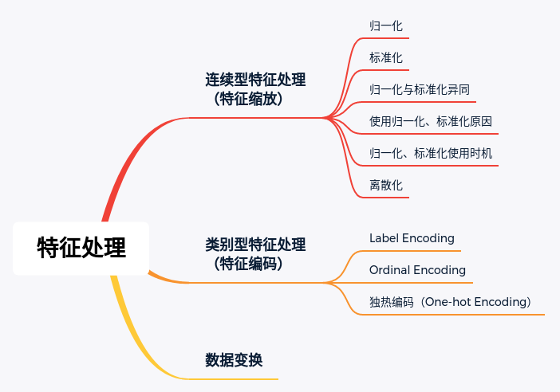
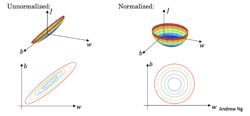
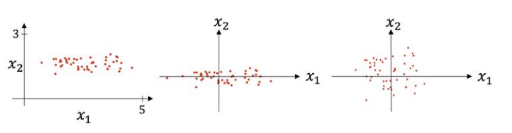

> 数据可以分为结构化数据和非结构化数据。这里主要介绍结构化数据的特征处理

- **结构化数据**，即行数据，存储在数据库里，可以用二维表结构来逻辑表达实现的数据

- **非结构化数据**，是不方便使用数据库二维逻辑来表示的数据，包括所有格式的办公文档、文本、图片、音频、视频、XML、HTML等

- 结构化数据的特征处理主要包括：

  

# 一、处理连续型特征（特征缩放）

> 通常，连续性特征需要处理，是因为**不同的连续型特征的值的范围是不同的；**

- 如果直接使用值范围相差很大的数据进行训练，存在的问题：
  1. 模型训练起来比较困难
  2. 并且难以得到比较好的表现
- 举例，我们收集一个人的数据，包括这个人的年龄、工资、身高等等，可以看出不同的特征值的范围是不同的，年龄在 0~100，工资范围波动很大，身高在 30 ~ 200
- 特征缩放通常存在两种方法：归一化（Normalization）和标准化（Standardization）；注意与正则化（Regularization）的区别：
  1. 归一化和标准化解决不同单位和比例的数据间的差异，用于特征缩放
  2. 正则化主要解决模型的过拟合问题

## 1）归一化（**Normalization**）

> 归一化（Normalization）是将数据转换到某一个**固定的区间（范围）内**，通常这个区间是 `[0, 1]`，但是广义上讲，可以是任何的区间

1. **Min-Max scaling** 是最常用的归一化方法，通常讲的 Normalization 就是 Min-Max scaling

   - 映射方法：
     $$
     X_{n o r m}=\frac{X-X_{\min }}{X_{\max }-X_{\min }}
     $$

   - Min-Max scaling 方法保留了原始数据之间的关系，但是如果新输入的数据超过了原始数据的范围，即不在 $[X_{min}, X_{max}]$ 中，则会产生越界错误

     

2. **均值归一化（Mean Normalization）**

   与Min-Max归一化类似，区别是使用平均值 μ 替代分子中的最小值

   - 映射方法：
     $$
     X_{norm}=\frac{X-\mu}{X_{\max }-X_{\min }}
     $$

   - 这种方法，将数据映射到 `[-1, 1]` 的区间中，均值为 0

## 2）标准化（Standardization）

> 也称之为 Z-score normalization，这种方法将数据变换为**均值为 0，标准差为 1 的分布**
>
> **注意**：这种方法得到的**不一定是标准正态分布**，而是保持原来的分布不变，只有原始数据满足正太分布的时候，得到的才是标准正态分布【通常只有**假设数据满足正态分布**的时候才会使用这种缩放方法】

- 映射方法：
  $$
  x^{\prime}=\frac{x-\operatorname{mean}(x)}{\sigma(x)}
  $$

  - 其中 mean(x) 为均值，$\sigma(x)$ 为标准差

    

    原图→ 减去均值 → 除以标准差

- 均值和方差的计算和数据集中的每一个样本都有关系，因此，和归一化相比，标准化更加注重数据集中样本的分布状况

- 因为考虑了所有的样本，因此少量的异常值对于均值和标准差影响较小

## 3）归一化与标准化的异同

1. 相同点：
   - 都是对数据的某一个特征进行缩放，消除范围、量纲的影响
2. 不同点：
   - 归一化严格限定变换后数据的范围，比如 `[0, 1]` 区间；而标准化并不会限制这个范围，只是均值为 0，标准差为 1
   - 归一化对数据的缩放比例仅仅与最大、最小值有关；而标准化考虑了所有的样本
   - 归一化受离群点影响较大，通常适合于小而稳定的数据集
   - 标准化受离群点影响较小，通常适合于嘈杂的大数据集

## 4）使用归一化、标准化的原因

1. 机器学习任务中很多地方要用到“距离”的计算，如果不同特征的范围不同，会导致距离的计算依赖于值比较大的那些特征；经过归一化、标准化，可以**提升模型的表现**
2. 使用梯度下降算法优化模型，使用归一化或者标准化可以加快梯度下降的求解速度，**更快地收敛**
3. 缓解梯度爆炸（消除过大值的影响）

## 5）归一化、标准化使用的时机

> **机器学习中标准化是更常用的手段，归一化的应用场景相对有限；**当然这里使用归一化还是标准化并没有明确的答案，在实践中可以两种方法都尝试一下

1. **使用标准化的场景**：
   - 当特征符合或者近似符合或者假设符合正太分布的时候
   - 当数据中存在离群点时
   - 在分类、聚类算法中，需要使用距离来度量相似性的时候、或者使用PCA技术进行降维的时候，标准化表现更好
2. **使用归一化的场景**：
   - 对处理后的数据范围有严格要求
   - 如果明确知道数据的分布不是正态分布，一般使用归一化

## 6）归一化、标准化是不是必须的

- 决策树模型不需要进行归一化、标准化，因为没有关于“距离”的衡量
- 概率模型，如朴素贝叶斯，不需要归一化、标准化，因为不关心变量的值，只关心概率
- 涉及到距离计算的如 PCA，Kmeans，KNN 都需要进行归一化、标准化
- 逻辑回归、深度学习、SVM：
  - 如果没有使用正则化，则使用归一化、标准化不是必须的
    - 但是如果没有使用正则化的基础上使用归一化、标准化对模型的训练也是有好处的
  - 如果使用了正则化，则使用归一化、标准化就是必须的
  - 原因分析：
    - 不用正则时，我们的损失函数**只是仅仅**在度量**预测与真实的差距**
    - 加上正则后，我们的损失函数除了要度量上面的差距外，还要度量**参数值**是否足够小
    - 而**参数值的大小程度或者说大小的级别是与特征的数值范围**相关的

### 注意：

- 需要注意的是，在标准化的时候不是使用整个数据集，而是要先将测试集拆分出来，在训练集上进行 fit，之后可以在训练集和测试集上进行 transform

## 7）连续变量离散化

> 将连续型特征变换为分类特征，即连续特征离散化；

- **主要的操作方法**：在数值的取值范围内设定若干个离散划分点，将取值范围划分为一些离散化的区间，最后用不同的符号或整数值代表每个子区间中的数据值
- 主要有两种方法：
  1. 等宽法：将数据均匀划分成 n 等份，每一份的间距相同
  2. 等频法：以相同数量的记录放进每个区间

# 二、处理类别型特征

> 类别型特征（Categorical features）指的是可以被分为不同组的特征，比如性别、国籍。在大多数的机器学习算法中，需要将非数字的值转变为 int 或者 float 类型

## 1）**Label Encoding**

> Label encoding 是直接**将类别用一个数字代替**，通常这种方法用于 label 的编码

```python
>>> from sklearn import preprocessing
>>> le = preprocessing.LabelEncoder()
>>> le.fit(["paris", "paris", "tokyo", "amsterdam"])
LabelEncoder()
>>> list(le.classes_)
['amsterdam', 'paris', 'tokyo']
>>> le.transform(["tokyo", "tokyo", "paris"])
array([2, 2, 1]...)
>>> list(le.inverse_transform([2, 2, 1]))
['tokyo', 'tokyo', 'paris']
```

- 注意，因为 Label Encoding 主要应用在 Label 上，因此，不能处理多维的情况
- 在处理特征时候，类似的使用一个数字表示一个类型，使用的是 Ordinal Encoder

## 2）**Ordinal Encoding**

> 这种方法与 Label Encoding 非常相似，只不过是用来处理数据中的特征；这种方法称之为序号编码，一般用于处理**类别间具有大小关系**的数据
>
> 对于一个具有 m 个类别的特征，我们将其对应地映射到 [0, m-1] 的整数

```python
>>> from sklearn.preprocessing import OrdinalEncoder
>>> enc = OrdinalEncoder()
>>> X = [['Male', 1], ['Female', 3], ['Female', 2]]
>>> enc.fit(X)
OrdinalEncoder()
>>> enc.categories_
[array(['Female', 'Male'], dtype=object), array([1, 2, 3], dtype=object)]
>>> enc.transform([['Female', 3], ['Male', 1]])
array([[0., 2.],
       [1., 0.]])
```

## 3）独热编码（One-hot Encoding）

> 独热编码通常用于处理**类别间不具有大小关系**的特征，这种是使用 N 个状态位来对 N 个类型进行编码

- 举例：

  - 优：[1, 0, 0]
  - 良：[0, 1, 0]
  - 差：[0, 0, 1]

- 代码：

  ```python
  >>> from sklearn.preprocessing import OneHotEncoder
  
  >>> enc = OneHotEncoder(handle_unknown='ignore')
  >>> X = [['Male', 1], ['Female', 3], ['Female', 2]]
  >>> enc.fit(X)
  OneHotEncoder(handle_unknown='ignore')
  >>> enc.categories_
  [array(['Female', 'Male'], dtype=object), array([1, 2, 3], dtype=object)]
  >>> enc.transform([['Female', 1], ['Male', 4]]).toarray()
  array([[1., 0., 1., 0., 0.],
         [0., 1., 0., 0., 0.]])
  >>> enc.inverse_transform([[0, 1, 1, 0, 0], [0, 0, 0, 1, 0]])
  array([['Male', 1],
         [None, 2]], dtype=object)
  >>> enc.get_feature_names_out(['gender', 'group'])
  array(['gender_Female', 'gender_Male', 'group_1', 'group_2', 'group_3'], ...)
  ```

- 独热编码的优点：

  1. 能够处理非数值特征，比如性别
  2. 在一定程度上也起到了扩充特征的作用
  3. 能够处理缺失值，增加一个维度表示缺失即可，即 N+1 个维度来表示 N 个不同的类别

- 缺点：

  1. 稀疏编码，每一列只有一个 1，其他都是 0
  2. One-hot 编码会使得空间维度大大增加，增加了训练的难度；可以考虑使用 PCA 降维缓解特征空间庞大的问题
  3. 对数值大小不敏感的模型（如树模型）不建议使用独热编码。原因：
     - 产生样本切分不平衡问题，此时切分增益会非常小
     - 影响决策树的学习

- **使用场景**：一般会用于**类别数较小且模型对数值大小较敏感**的情况，如 LR 和 SVM，类别数量一般不会超过 5

- 实现独热编码的另一种方法：

  - 使用 Pandas 库中的方法：

  ```python
  s = pd.Series(list('abca'))
  print(pd.get_dummies(s))
  
  output:
     a  b  c
  0  1  0  0
  1  0  1  0
  2  0  0  1
  3  1  0  0
  ```

# 三、数据变换

### 1）应用场景

- 数据不是正态分布的时候
- 当前特征数据不利于被模型捕获利用

### 2）常用数据变换方法

- 常用的函数变换法（通常应用于连续数据）：
  - 平方
  - 开平方
  - 指数
  - 对数：
    - 它有助于处理倾斜数据，在转换后，分布变得更接近正态。
    - 由于幅度差异的归一化，它也降低了离群值的影响，模型变得更加稳健。
  - 差分

### 3）优缺点

- 优点：
  1. 将不具有正态分布的数据变换成具有正态分布的数据
  2. 对于时间序列分析，有时简单的对数变换和差分运算就可以将非平稳序列转换成平稳序列

# Reference

1. [结构化数据与非结构化数据的区别](https://zhuanlan.zhihu.com/p/29856645)