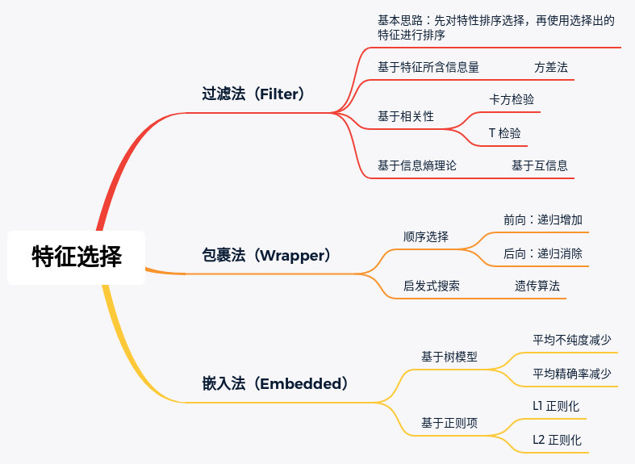
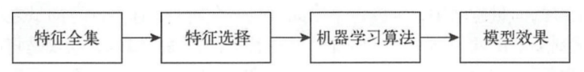
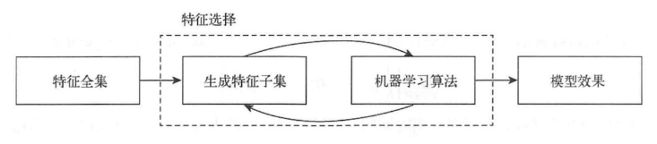
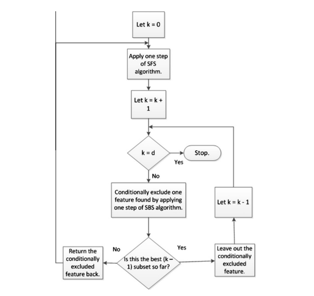
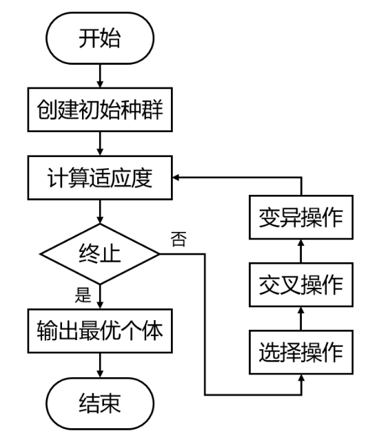
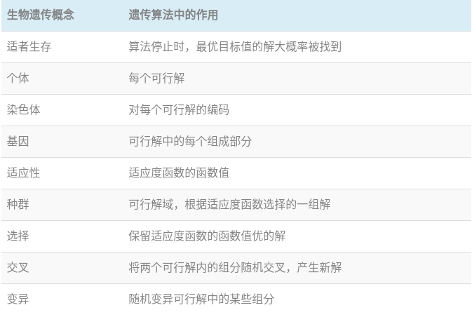
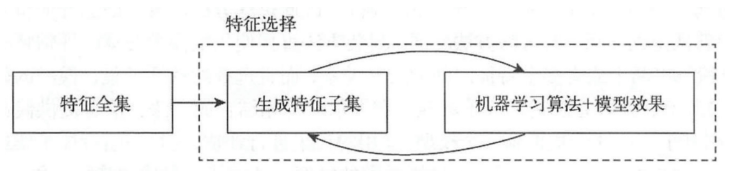
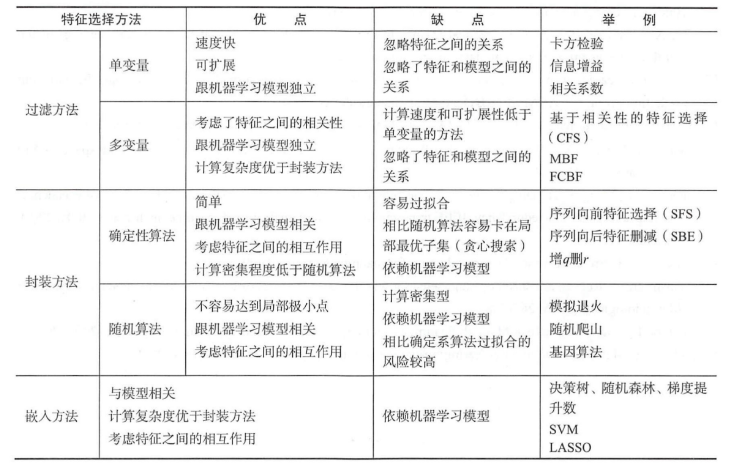

> 下面介绍的方法将会有助于处理结构化的数据，如果是非结构化的数据，如图片、文本、语音，则需要学习不同的方法

## 1）背景

1. **什么是特征选择（feature selection）**

   > 特征选择是手动或者自动地从所有特征中选择与正在处理的任务最相关的

   - 特征选择和降维（dimensionality reduction）都是为了减少特征的数量，但是**特征选择不同于降维**
     - 降维是创造特征的新组合，比如PCA 和 SVD
     - 特征选择则只是从原有特征中进行选择或排除，不涉及原有特征的转变

2. **为什么使用 Features Selection**

   1. 通过去除不相关甚至是降低模型表现的 features，从而**提高训练速度、提升模型的表现**
   2. 降低模型的复杂度，使得模型可解释性更好
   3. 减缓过拟合
   4. 缓解维度灾难

3. 特征选择方法分类

   - Filter Methods
   - Wrapper Methods
   - Embedded Methods

### 特征选择的两个关键环节

- 背景：
  - 想要从初始的特征集合中选取一个包含所有重要信息的特征子集，若没有任何先验知识，则只能**遍历所有可能**的子集，然而这样在计算上显然不可能，尤其是在特征个数很多的情况下
  - **可行的方法**是：产生一个候选子集，评价它的好坏，基于评价结果产生下一个候选子集，再对其进行评价……持续这一过程，直到找不到更好的子集为止
  - 这一过程涉及到**两个关键环节**：如何根据评价结果获取下一个特征子集？如何评价候选特征子集的好坏？

1. **环节一：子集搜索问题**

   下面的策略都是贪心策略，仅考虑本轮选定集最优

   给定特征集合 a1, a2, ..., an

   - 前向搜索：
     - 选择一个最佳的单特征子集
     - 在此基础上加入一个特征，构建双特征候选子集，选择最优的一组
     - 依次类推，直到找不出更优的特征子集
   - 后向搜索：
     - 从完整特征集合开始
     - 每次去掉一个特征，直到去掉一个特征后，模型表现更差为止
   - 双向搜索：
     - 将前向和后向搜索结合，每一轮增加相关特征，同时减少无关特征

2. **环节二：子集评价问题**

   - 以离散型特征的信息增益为例，给定数据集 D，假定第 i 类样本的比例为 pi，则信息熵的定义为：
     $$
     \operatorname{Ent}(D)=-\sum_{i=1}^{n} p_{k} \log *{2} p*{k}
     $$

   - 对于特征子集 A，假定根据其取值将 D 分成了 V 个子集 D1,D2, ..., DV，每个子集的样本在 A 上取值相同，于是我们可以计算属性子集 A 的信息增益为：
     $$
     \operatorname{Gain}(A)=\operatorname{Ent}(D)-\sum_{v=1}^{V} \frac{\left|D^{v}\right|}{|D|} \operatorname{Ent}\left(D^{v}\right)
     $$

   - 信息增益越大，意味着特征子集 A 包含的有助于分类的信息越多。于是，对于每个特征子集，我们可以基于训练集 D 来计算其信息增益，以此作为评价标准

## 2）Filter Methods（过滤式）

> 基本思路：**先对数据集进行特征选择，然后再训练模型**，特征选择过程与后续模型训练无关；对每一维的特征“打分”，即给每一维的特征赋予权重，这样的权重就代表着该维特征的重要性，然后依据权重排序。

显然，如何评估特征的价值高低从而实现排序是这里的关键环节，为了评估特征的价值高低，大体可分为3类评估标准

### 基于特征所含信息量的高低

> 一般就是特征基于**方差法**实现的特征选择，即认为**方差越大对于标签的可区分性越高**；否则，即低方差的特征认为其具有较低的区分度
>
> 极端情况下当一列特征所有取值均相同时，方差为 0，对于模型训练也不具有任何价值

- 直接使用方差法是不严谨的，因为会有不同特征对应的值范围不同的问题，因此，通常要进行归一化

### 基于相关性

> 通常是**基于统计学理论**，计算不同特征与标签列的相关系数，如果某一个特征与标签列相关性较高的时候，认为这个特征的价值较大

- 度量相关性的指标包括欧氏距离、卡方检验、T 检验等

### 基于信息熵理论

> 与基于统计学的相关性方法类似，从**信息论的角度**来度量特征与标签列的相关程度

- 典型的方法就是计算某一特征与标签列之间的互信息，互信息越大，意味着这个特征对标签的信息确定程度越高
- 非常类似于决策树

### 过滤式方法的缺点

1. 因为不依赖于模型，所以不能有针对性地挖掘与模型相适应的特征集合
2. 特征排序、选择是独立的，即不会考虑特征之间的组合；有时候存在某些特征，单独使用价值低，但是组合使用价值高，使用这种方法就不能发现

## 3）Wrapper Methods（包裹式）

> 基本思想：将特征的选择看做一个搜索寻优问题，**评估、比较不同的特征组合**；使用一个预测模型来评估一个特征组合，并根据模型的表现进行打分

> 搜索的过程可以是有条理的，如 best-first search；可以是随机的，如 random hil-climbing 算法；可以是启发式的，如 GA，PSO，DE，ABC

- 包裹法将特征选择看做是一个黑盒问题：
  - 即仅需指定目标函数（这个目标函数一般就是特定模型下的评估指标）
  - 通过一定方法实现这个目标函数最大化，而不关心其内部实现的问题
- 具体来说，给定一个有 N 个特征的特征选择问题，可以将特征选择抽象为从 N 个特征中选择 K 个特征子集，从而实现目标函数最优
  - K 取值范围为 [1, K]
  - 问题的复杂度为 O(2^N)
- 这样的问题如果直接使用暴力的方法，算力的开销是非常巨大的，通常有两种不同的解决方法：
  1. 顺序选择（贪心算法）
  2. 启发式搜素

### 顺序选择

> 顺序选择算法实际上就是贪心算法

- 即将含有K个特征的最优子空间搜索问题简化为：

  - 从 1→K 的递归式选择（Sequential Feature Selection, SFS）过程，称之为前向选择
  - 从N → K的递归式消除（Sequential Backward Selection, SBS）的过程，称之为后向选择

- 上面提及的是最原始的两种方法，在实际运用中也衍生出一些变形，Sequential Floating Forward Selection (SFFS) 流程图：

  

### 启发式搜索

> 遗传算法（Genetic Algorithm, GA）可以用来搜索特征子集，通过找出目标函数的全局最大值，就可以找出最优的特征子集，这里的目标函数是模型的表现
>
> 可以在进化算法（Evolutionary Algorithm）的总体思路内修改遗传算法的参数和操作，以适应数据，来获得最好的搜索结果

- 遗传算法的基本流程：

  

- 遗传算法中的名词概念：

  

- CHCGA 是遗传算法的变形，可以用来选择特征，与一般遗传算法的不同点：

  - 从父母和后代中选出最好的N个个体，即较好的后代取代较不适合的父母
  - 采用高度分裂的半均匀交叉(HUX)算子对非匹配等位基因的一半进行交叉，其中要交叉的位是随机选择的
  - 每个亲代种群成员随机选择，没有替换，并配对进行交配。只有亲代的汉明距离（Hamming distance）的一半超过阈值 d，才进行交配
  - 如果没有后代产生，并且阈值下降到零，就会引入灾难性的突变来创造一个新的群体

- 相比于传统遗传算法，CHCGA 通过保持多样性和避免种群停滞更快地收敛于解决方案并提供更有效的搜索

### 包裹式方法的缺点

1. 寻找特征子集的过程耗费大量计算资源
2. 使用分类器性能作为目标函数容易导致过拟合；为缓解过拟合，可以用一个单独的保留测试集可以用来指导搜索的预测准确性

## 4）**Embedded Methods（嵌入式）**

> 基本思想：嵌入方法主要通过**将特征选择作为训练过程的一部分**，以减少包裹式方法对不同子集重新分类所花费的计算时间；

> 实际上就是在模型训练的过程中考虑特征选择，比如下面的添加正则项

### 基于正则化的特征选择方法

> 嵌入式方法中最常用的方法之一就是**正则化方法**

- L1 正则化（Lasso）：将参数 w 的 l1 范数作为惩罚项加到损失函数上；
  - 由于正则项非零，这就迫使那些弱的特征所对应的系数变成 0
  - 因此 L1 正则化往往会使学到的模型很稀疏（系数w经常为 0）
  - 这个特性使得 L1 正则化成为一种很好的特征选择方法
- L2 正则化（Ridge）：将参数向量的 L2 范数添加到损失函数中：
  - 由于L2惩罚项中系数是二次方的，这使得L2和L1有着诸多差异
  - 最明显的一点就是，L2正则化会让系数的取值变得平均
  - 对于关联特征，这意味着他们能够获得更相近的对应系数
- **L1正则方法具有稀疏解的特性，因此天然具备特征选择的特性，但是要注意，L1没有选到的特征不代表不重要，原因是两个具有高相关性的特征可能只保留了一个，**如果要确定哪个特征重要应再通过L2正则方法交叉检验；

### 基于树模型的特征选择方法

> 随机森林具有**准确率高、鲁棒性好、易于使用**等优点，这使得它成为了目前最流行的机器学习算法之一。
>
> 随机森林提供了两种特征选择的方法：**平均不纯度减少（\**mean decrease impurity\**）** 和 平均精确率减少（mean decrease accuracy）

- 基于树的预测模型能够用来**计算特征的重要程度**，因此能用来去除不相关的特征

1. **平均不纯度减少 (Mean Decrease Impurity)**

   随机森林由多个决策树构成：

   - 决策树中的每一个节点都是关于某个特征的条件，为的是将数据集按照不同的响应变量一分为二。
   - 利用不纯度可以确定节点（最优条件），对于分类问题，通常采用 **基尼不纯度** 或者 **信息增益** ，对于回归问题，通常采用的是 **方差** 或者 **最小二乘拟合**。
   - 当训练决策树的时候，可以计算出每个特征减少了多少树的不纯度。对于一个决策树森林来说，可以算出每个特征平均减少了多少不纯度，并把它平均减少的不纯度作为特征选择的值。

2. **平均精确率减少 (Mean Decrease Accuracy)**

   另一种常用的特征选择方法就是**直接度量每个特征对模型精确率的影响**。

   - 主要思路是打乱每个特征的特征值顺序，并且度量顺序变动对模型的精确率的影响。
   - 很明显，对于不重要的变量来说，打乱顺序对模型的精确率影响不会太大，但是对于重要的变量来说，打乱顺序就会降低模型的精确率。

## 5）方法比较

1. 对于理解数据、数据的结构、特点来说，**单变量特征选择**是个非常好的选择。
   - 尽管可以用它对特征进行排序来优化模型，但由于它**不能发现冗余**（例如假如一个特征子集，其中的特征之间具有很强的关联，那么从中选择最优的特征时就很难考虑到冗余的问题）。
2. 正则化的线性模型对于特征理解和特征选择来说是非常强大的工具。
   - **L1正则化能够生成稀疏的模型，对于选择特征子集来说非常有用；**
   - **相比起L1正则化，L2正则化的表现更加稳定，由于有用的特征往往对应系数非零，因此L2正则化对于数据的理解来说很合适。**
3. 随机森林是一种非常流行的特征选择方法
   - 它易于使用，**一般不需要feature engineering、调参等繁琐的步骤，并且很多工具包都提供了平均不纯度下降方法**。
   - 它的两个主要问题：
     - 一个是重要的特征有可能得分很低（关联特征问题），
     - 另一个是这种方法对特征变量类别多的特征越有利（偏向问题）

