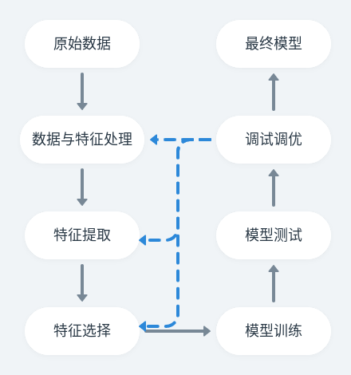
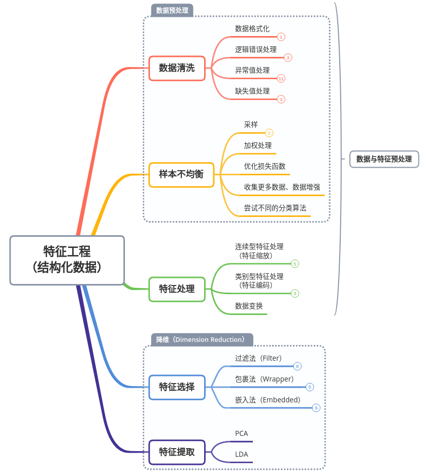

> Garbage in，garbage out；数据的质量是模型表现的天花板，而模型和算法就是不断逼近这个天花板

- 对于初学者来说，数据的处理可能是比较棘手的问题，因为不同来源的数据有其本身的特点，不能够使用相同的方法进行清洗和处理

  **注意数据的每一步操作都要备份或者使用版本控制工具**

  

# 一、相关背景

> 特征工程本质上是一项工程活动，是将**原始数据**处理为机器学习或者统计学习模型中可以使用的 **features** 的过程

- 高质量特征的好处：
  1. 提升模型表现
  2. 提高训练速度
  3. 降低模型复杂度
- 高质量数据的特点：
  1. 有效性：即**数据符合定义的业务规则或者约束的程度**，如：
     1. 数据类型约束：值必须是指定的类型，如数字、布尔类型等等
     2. 范围约束：数字必须在一定的范围之内
     3. 唯一性约束：一个字段或者组合必须在数据集中是唯一的
     4. 跨字段验证：必须满足跨越多个字段的某些条件
  2. 准确性：**即数据接近真实值的程度**
  3. 完整性：**所有数据的完整程度**
     - 因为一些原因，数据可能有缺失
  4. 一致性：**数据集中不同样本之间的一致程度**
     - 当数据集中两个值相互矛盾的时候，就会出现不一致的问题

# 二、特征工程

> 特征工程并没有严格的执行顺序，一般的顺序为数据预处理、特征处理、特征选择、特征提取

- 特征工程主要包括下面几个部分：

  数据预处理

  特征处理

  特征选择

  特征提取

  

### 特征提取与特征选择的区别

> 特征提取与特征选择是降维（Dimension Reduction）的两种方法

1. 概念：
   1. **特征提取**：根据现有的特征创建新的特征子集（Creatting a subset of new features by combinations of the exsiting features），即创造了新的特征
   2. **特征选择**：从现有的特征集中选择出一部分（choosing a subset of all the features [the ones more informative]），集选择后的特征是原来特征的子集
2. 相同点：
   - 达到的效果类似，都是试图去减少特征集中特征的数量
3. 不同点：
   - 特征提取是通过特征之间的组合，得到新的特征，改变了原来的特征空间；
   - 特征选择是从原来特征集中选择出一部分，并没有得到新的特征，没有改变原来的特征空间

### 为什么进行降维操作

1. VC 维理论：

   根据 VC 维理论，VC 维越高，打散能力越强，可容许的模型复杂度越高。在**低维不可分的数据，映射到高维是可分**

2. 为什么降维（特征提取和特征选择操作）：

   1. 特征维数越高，模型越容易过拟合，此时更复杂的模型就不好用
   2. 相互独立的特征维数越高，在模型不变的情况下，在测试集上达到相同的效果表现所需要的训练样本的数目就越大
   3. 特征数量增加带来的训练、测试以及存储的开销都会增大
   4. 在某些模型中，例如基于距离计算的模型KMeans，KNN等模型，在进行距离计算时，维度过高会影响精度和性能
   5. 可视化分析的需要

# Reference

1. [Machine Learning Tutorial – Feature Engineering and Feature Selection For Beginners](https://www.freecodecamp.org/news/feature-engineering-and-feature-selection-for-beginners/)
2. [特征工程之数据预处理（上）](https://zhuanlan.zhihu.com/p/56479125)
3. [特征工程之数据预处理（下）](https://zhuanlan.zhihu.com/p/56557301)
4. [特征工程之特征缩放&特征编码](https://zhuanlan.zhihu.com/p/56902262)
5. [About Feature Scaling and Normalization](https://sebastianraschka.com/Articles/2014_about_feature_scaling.html#about-min-max-scaling)
6. [**机器学习笔记之数据缩放 标准化和归一化**](https://www.cnblogs.com/JetpropelledSnake/p/14438484.html)
7. [标准化和归一化，请勿混为一谈，透彻理解数据变换](https://blog.csdn.net/weixin_36604953/article/details/102652160)
8. [[机器学习\] 数据特征 标准化和归一化](https://blog.csdn.net/zwqjoy/article/details/81182102)
9. **[数据特征 标准化和归一化你了解多少？](https://baijiahao.baidu.com/s?id=1609320767556598767&wfr=spider&for=pc)**
10. [一文弄懂特征缩放(归一化/正则化)](https://blog.csdn.net/yjw123456/article/details/106252908)
11. [吴恩达课程 — 机器学习](https://www.coursera.org/learn/machine-learning)
12. [特征标签编码：LabelEncoder、LabelBinarizer、OneHotEncoder三者的区别](https://www.jianshu.com/p/03c4b9649838)
13. [**特征编码总结 Kaggle](https://zhuanlan.zhihu.com/p/117230627)【**还有许多可以研究**】**
14. **[An Introduction to Feature Selection](https://machinelearningmastery.com/an-introduction-to-feature-selection/)【不错】**
15. [教你如何做特征选择](https://cloud.tencent.com/developer/article/1528342)
16. **[机器学习（六）：特征选择方法—Filter,Wrapper,Embedded](https://zhuanlan.zhihu.com/p/120924870)【\**非常好\**】**
17. [一文掌握机器学习中的三种特征选择方法](https://www.bilibili.com/read/cv13288230)
18. [**A sruvey on feature selection methods](http://romisatriawahono.net/lecture/rm/survey/machine learning/Chandrashekar - Feature Selection Methods - 2014.pdf)【论文】**
19. [特征选择综述阅读：A survey on feature selection methods](https://blog.csdn.net/qq_45375932/article/details/120859118)
20. [Python 手把手构建遗传算法（GA）实现最优化搜索](https://finthon.com/python-genetic-algorithm/)
21. [Feature Selection](http://gitlinux.net/2018-10-25-feature-selection/)
22. [为何推荐sklearn做单机特征工程？【下】](https://mp.weixin.qq.com/s/1RHBQMlC8eyJcbNcArTtCQ)
23. [基于模型的特征选择详解 (Embedded & Wrapper)](https://www.cnblogs.com/stevenlk/p/6543646.html)
24. **[【陆勤学习】解读机器学习基础概念：VC维的来龙去脉](https://cloud.tencent.com/developer/article/1044419)**
25. **[机器学习中的数据清洗与特征处理综述](https://tech.meituan.com/2015/02/10/machinelearning-data-feature-process.html)**
26. **[自然语言处理时，通常的文本清理流程是什么？](https://www.zhihu.com/question/268849350)**
27. **[机器学习：数据预处理](https://www.heywhale.com/mw/project/604737e774dfc60016debd1e/content)【非常全面】**

