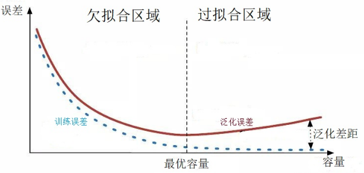
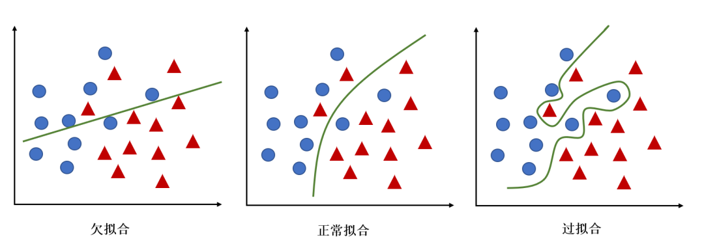
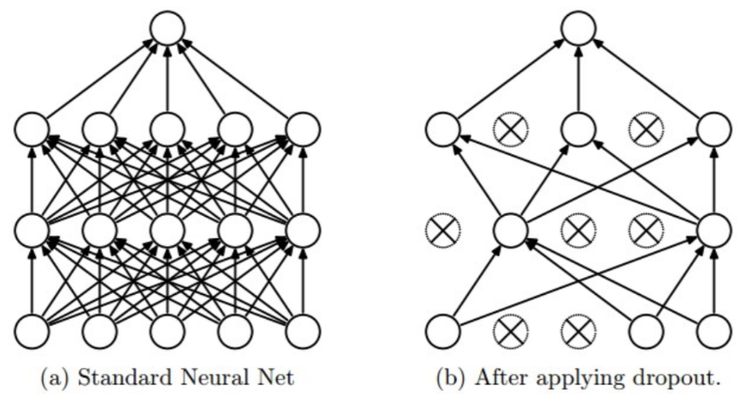

# 一、现象及原因

- 我们训练模型的目的是为了让模型在**未知数据上有最好的泛化能力**，即泛化误差要最小；

- 但是我们不可能使用无限的数据进行训练，只能使用训练集训练模型，这个过程中会得到一个训练误差；

- 训练误差并不是越小越好，如下图所示：

  

1. 过拟合：
   - 现象：**过拟合的基本表现就是在训练集上表现很好，但是在测试集上表现不好**
   - 原因：
     1. 因为模型**过于复杂**，将训练集中一些 noise 也学到了
   - 注意：过拟合与 MisMatch 的区别，详见【机器学习任务攻略】
2. 欠拟合：
   - 现象：**欠拟合的基本表现是在训练集和测试集上表现都不好**
   - 原因：
     1. 模型**过于简单**
     2. 特征量过少

# 二、解决方案

## 1）欠拟合

1. 增加新特征：可以考虑加入进特征组合、高次特征，来增大假设空间
2. 提高模型复杂度，提高模型拟合能力
3. 降低正则化参数

## 2）过拟合

### 2.1 增加训练样本量

1. 收集更多的训练样本
2. 数据增强

### 2.2 正则化

- 正则化（Regularization）是处理过拟合的有效方法
- 常用的有 L1 和 L2 Regularization，详见【正则化】相关内容

### 2.3 降低特征的数量

- 即使用较少的 features
- 对于一些特征工程而言，可以降低特征的数量——删除冗余特征，人工选择保留哪些特征。这种方法也可以解决过拟合问题。

### 2.4 使用合适的模型（控制模型的复杂度）

> 奥卡姆剃刀法则：简单有效原则

- 针对不同的任务特点，选择合适的模型，要控制模型中参数的数量
- 比如卷积神经网络，相比于全连接神经网络，实际上是一种共享参数的机制，可以大大简化模型，减少模型中的参数

### 2.5 Early stopping（提前终止）

> Early stopping是一种**迭代次数截断**的方法来防止过拟合的方法，即在模型对训练数据集迭代收敛之前停止迭代来防止过拟合

- 在模型进行训练的过程中，需要迭代地训练多个 epoch
- 如果训练的 epoch 过多，可能导致欠拟合；相反，迭代的次数过多，可能导致过拟合；
- Early stopping旨在解决 epoch 数量需要手动设置的问题。具体做法：
  - 每个 epoch（或每N个epoch）结束后，在验证集上获取测试结果；
  - 随着 epoch 的增加，如果在验证集上发现测试误差不再降低，甚至是上升，则停止训练，将停止之后的权重作为网络的最终参数
- Early Stopping缺点：**没有采取不同的方式来解决优化损失函数和过拟合这两个问题**
  - 是用一种方法同时解决两个问题 ，结果就是要考虑的东西变得更复杂。
  - 之所以不能独立地处理，因为如果停止了优化损失函数，你可能会发现损失函数的值不够小，同时你又不希望过拟合

### 2.6 Dropout

> 在神经网络的训练过程中，对于一次迭代中的某一层神经网络，先**随机选择**其中的一些神经元并将其临时隐藏(丢弃)，然后再**进行本次训练和优化（梯度下降，反向传播）**
>
> 在下一次迭代中，继续随机隐藏一些神经元，如此直至训练结束

1. Dropout 的运作方式

   - 在**训练时**，每个神经单元以概率 $p$ 被保留(Dropout丢弃率为 $1−p$)；
   - 在**测试阶段**，每个神经单元都是存在的，权重参数 $w$ 要乘以 $p$，输出是：$pw$

2. **测试阶段乘以 $p$ 的原因**：

   - 前一层隐藏层的一个神经元在dropout之前的输出是 $x$
   - 训练时dropout之后的期望值是 $E=p x+(1-p) \dot{0}$
   - 在预测阶段该层神经元总是激活的，为了保持同样的输出期望值并使下一层也得到同样的结果，需要调整 $x$ → $px$

3. 反向 Dropout

   > 该方法包括在**训练阶段缩放激活函数，从而使得其测试阶段保持不变**

   - 实现的方法是：在训练时候对数据进行 $\frac{1}{p}$ 缩放，而在测试阶段不需要进行任何特殊的操作

4. Dropout 为什么可以缓解过拟合

   1. **取平均**的作用，**相当于一次训练了多个子神经网络**，这几个神经网络取平均，从而达到了类似集成学习的效果；
   2. 减少神经元之间复杂的共适应关系：Dropout通过使其它隐藏层神经网络单元不可靠，从而阻止了共适应的发生。因此，一个隐藏层神经元不能依赖其它特定神经元去纠正其错误

# Reference

1. [欠拟合、过拟合及如何防止过拟合](https://zhuanlan.zhihu.com/p/72038532)
2. [欠拟合和过拟合出现原因及解决方案](https://www.cnblogs.com/zhhfan/p/10476761.html)
3. [Dropout原理与实现](https://www.cnblogs.com/zingp/p/11631913.html)
4. [深度学习中Dropout原理解析](https://zhuanlan.zhihu.com/p/38200980)